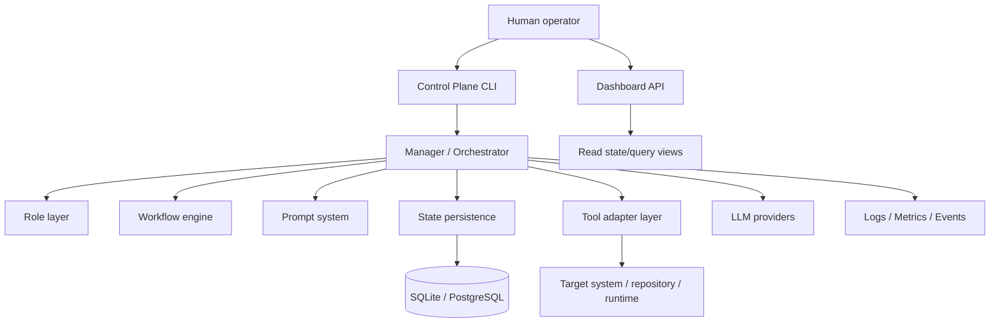
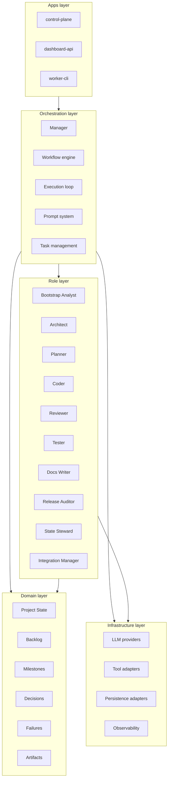
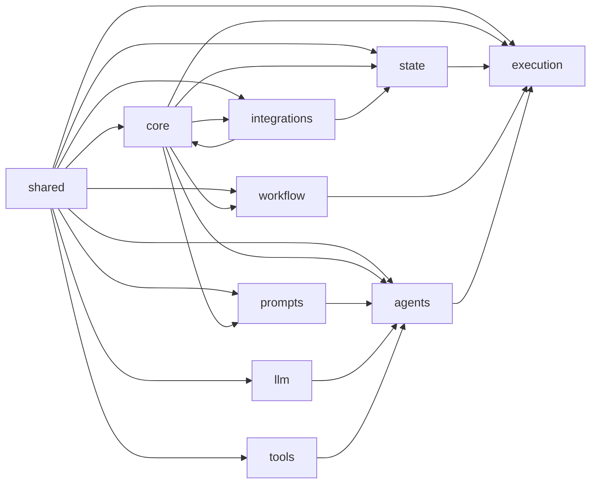
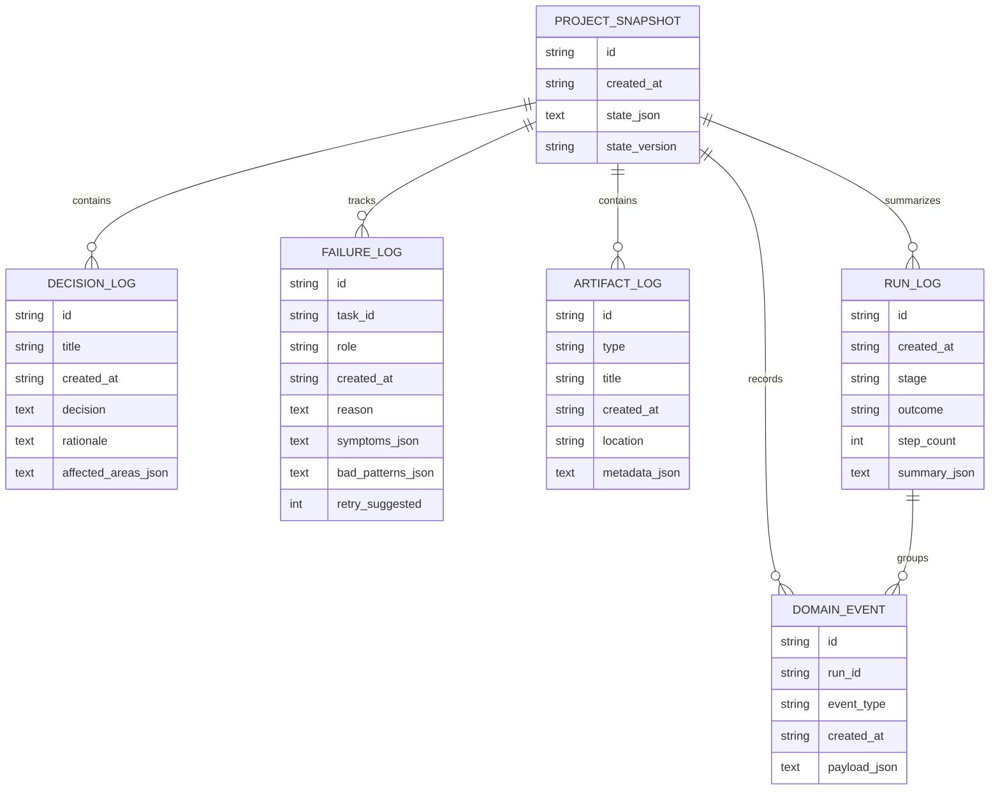
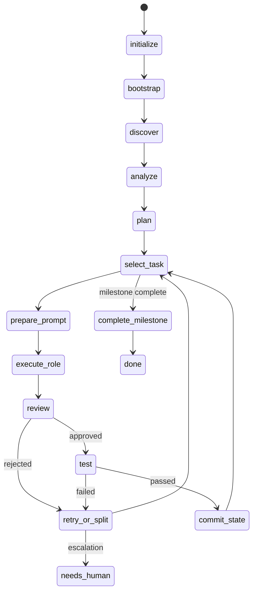
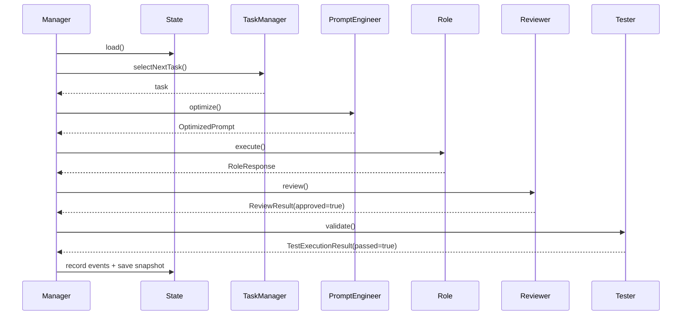
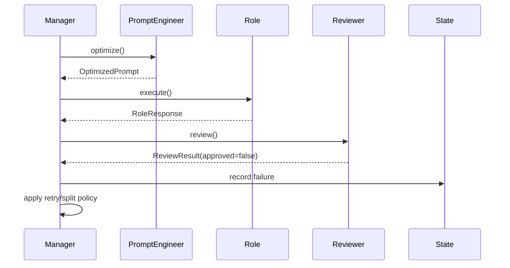
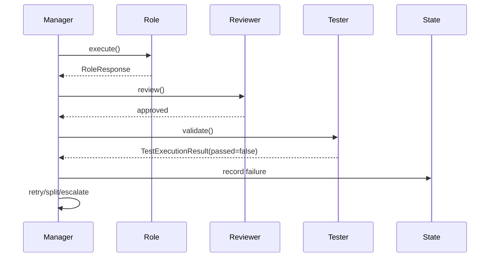
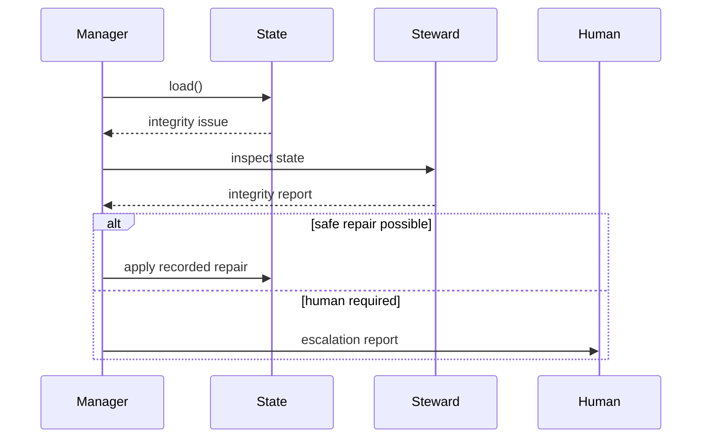

# AI Orchestrator — Production RFC v4

**Status:** Draft v4  
**Document type:** Production-oriented Architecture RFC  
**Audience:** architects, backend engineers, platform engineers, AI engineering teams, technical program leads  
**Format:** Markdown  
**Purpose:** review, redline editing, implementation planning, delivery handoff, RFC circulation

---

# 1. Executive summary

This document defines a production-oriented architecture for an **AI Orchestrator**: a stateful orchestration backend that coordinates specialized AI roles to perform bounded, auditable, policy-driven work over a target system.

This specification is the most detailed version of the design and is intended to eliminate implementation ambiguity as much as possible.

It covers:

- system architecture
- domain model
- package structure
- role design
- workflow and state machines
- database schema
- JSON schemas for role outputs
- API contracts
- CLI contracts
- persistence strategy
- observability
- safety and security controls
- failure handling
- MVP and post-MVP roadmap
- implementation sequencing
- open questions and extension points

This system is not a generic autonomous agent shell. It is an **engineering control plane** with:

- explicit policy
- strict role boundaries
- durable state
- milestone-based progression
- review and test gates
- retry / split / escalate logic
- human intervention points

---

# 2. Problem definition

Many AI-driven execution systems fail because they depend on one or more weak patterns:

- a single monolithic “super-agent”
- purely prompt-history-based execution
- no durable state model
- no formal review gate
- no formal validation gate
- no task lifecycle
- no milestone structure
- no retry adaptation
- no decision log
- no replayability
- no distinction between architecture, planning, coding, and testing

These weaknesses create predictable operational failures:

- uncontrolled scope expansion
- repeated low-quality retries
- self-approval loops
- inability to explain behavior
- poor debuggability
- no audit trail
- fragile orchestration logic
- weak safety posture

The AI Orchestrator exists to solve those problems by treating orchestration as a **backend system design problem**, not a chat prompt problem.

---

# 3. Goals and non-goals

## 3.1 Goals

The platform must:

- coordinate specialized AI roles through a central control plane
- maintain durable and inspectable execution state
- enforce explicit task lifecycle transitions
- support milestone-based execution
- provide review and validation gates
- support retries, task splitting, and escalation
- preserve auditability through events and snapshots
- support external reporting and export
- remain provider-agnostic at the LLM layer
- remain extensible for future distributed execution

## 3.2 Non-goals for MVP

The MVP will not include:

- fully distributed worker clusters
- automatic production deployment
- unrestricted repository mutation
- automatic merging without human policy
- unrestricted external system writes
- generalized multi-tenant SaaS concerns
- autonomous policy self-rewriting

---

# 4. Architectural principles

1. **Policy before autonomy**  
   The system must execute according to explicit workflow policy, not vague emergent behavior.

2. **State before memory-like prompting**  
   Durable state is the source of truth. Prompt context is derivative, not primary.

3. **Roles before free-form loops**  
   All major responsibilities must be mapped to explicit roles.

4. **Structured outputs before prose**  
   Critical outputs must be schema-validated.

5. **Gates before acceptance**  
   Non-trivial work must pass review and validation before being accepted.

6. **Adaptation before repetition**  
   Failures must change the next attempt through stricter prompts, task splitting, or escalation.

7. **Auditability before convenience**  
   Decisions, failures, and events must be recorded.

8. **Layering before convenience coupling**  
   Domain, orchestration, and infrastructure must stay separate.

---

# 5. System context

## 5.1 Context diagram



## 5.2 External dependencies

The orchestrator may depend on:

- one or more LLM providers
- a target repository or system
- optional SQL validation backend
- optional docs / HTTP fetch sources
- local or remote persistence backend
- human-driven CLI/API usage

---

# 6. Layered architecture

## 6.1 Layer model



## 6.2 Layer rules

### Apps layer
- may compose packages
- may expose commands and HTTP routes
- must not implement core orchestration business rules

### Orchestration layer
- owns task lifecycle transitions
- owns retries, splitting, escalation
- owns role routing
- must not depend on concrete LLM/provider implementation details

### Role layer
- implements specialized task logic
- returns structured outputs
- does not commit state
- does not own workflow transitions

### Domain layer
- contains pure types and contracts
- must be infrastructure-free
- is the stable contract surface for the system

### Infrastructure layer
- implements persistence, tools, providers, logging
- must not own orchestration policy

---

# 7. Monorepo structure

```text
ai-orchestrator/
├─ package.json
├─ pnpm-workspace.yaml
├─ turbo.json
├─ tsconfig.base.json
├─ .editorconfig
├─ .gitignore
├─ .env.example
├─ README.md
├─ docs/
│  ├─ adr/
│  ├─ rfc/
│  ├─ prompts/
│  ├─ diagrams/
│  ├─ schemas/
│  └─ examples/
├─ apps/
│  ├─ control-plane/
│  │  ├─ package.json
│  │  ├─ tsconfig.json
│  │  └─ src/
│  │     ├─ index.ts
│  │     ├─ bootstrap.ts
│  │     ├─ composition/
│  │     │  └─ buildRuntime.ts
│  │     └─ commands/
│  │        ├─ bootstrap.ts
│  │        ├─ runCycle.ts
│  │        ├─ runTask.ts
│  │        ├─ runMilestone.ts
│  │        ├─ showState.ts
│  │        ├─ showBacklog.ts
│  │        ├─ showRuns.ts
│  │        ├─ exportBacklog.ts
│  │        └─ exportSummary.ts
│  ├─ dashboard-api/
│  │  ├─ package.json
│  │  ├─ tsconfig.json
│  │  └─ src/
│  │     ├─ server.ts
│  │     ├─ routes/
│  │     │  ├─ state.ts
│  │     │  ├─ milestones.ts
│  │     │  ├─ backlog.ts
│  │     │  ├─ events.ts
│  │     │  ├─ failures.ts
│  │     │  ├─ decisions.ts
│  │     │  ├─ artifacts.ts
│  │     │  └─ runs.ts
│  │     └─ serializers/
│  │        └─ apiModels.ts
│  └─ worker-cli/
│     ├─ package.json
│     ├─ tsconfig.json
│     └─ src/
│        ├─ index.ts
│        └─ commands/
│           ├─ runRole.ts
│           └─ debugPrompt.ts
├─ packages/
│  ├─ core/
│  ├─ agents/
│  ├─ prompts/
│  ├─ workflow/
│  ├─ state/
│  ├─ llm/
│  ├─ tools/
│  ├─ execution/
│  ├─ integrations/
│  └─ shared/
└─ tests/
   ├─ unit/
   ├─ integration/
   ├─ e2e/
   └─ fixtures/
```

---

# 8. Package dependency map

## 8.1 Dependency graph



## 8.2 Hard dependency rules

- `core` must not depend on `llm`, `tools`, or app packages
- `agents` must not depend on `execution`
- `workflow` must not depend on concrete tools or providers
- `state` must not depend on `agents`
- `execution` is allowed to compose `workflow`, `state`, `agents`, `llm`, and `tools`
- `integrations` must not own workflow policy

---

# 9. Domain model

# 9.1 Core entities

The domain model contains the minimum stable surface the rest of the system depends on.

Entities:

- `ProjectState`
- `Milestone`
- `Epic`
- `Feature`
- `BacklogTask`
- `DecisionLogItem`
- `FailureRecord`
- `ArtifactRecord`
- `DomainEvent`
- `RunSummary`

---

# 9.2 ProjectState

```ts
export interface ProjectState {
  projectId: string;
  projectName: string;
  summary: string;
  currentMilestoneId?: string;

  architecture: {
    packageMap: string[];
    subsystemMap: string[];
    unstableAreas: string[];
    criticalPaths: string[];
  };

  health: {
    build: 'unknown' | 'ok' | 'failing';
    tests: 'unknown' | 'ok' | 'failing';
    lint: 'unknown' | 'ok' | 'failing';
    typecheck: 'unknown' | 'ok' | 'failing';
  };

  backlog: {
    epics: Epic[];
    features: Feature[];
    tasks: BacklogTask[];
  };

  milestones: Milestone[];

  execution: {
    activeRunId?: string;
    activeTaskId?: string;
    completedTaskIds: string[];
    blockedTaskIds: string[];
    retryCounts: Record<string, number>;
    stepCount: number;
  };

  decisions: DecisionLogItem[];
  failures: FailureRecord[];
  artifacts: ArtifactRecord[];
}
```

## 9.2.1 Invariants

- `currentMilestoneId` must refer to an existing milestone when present
- `activeTaskId` must refer to an existing task when present
- a task may not be both `completed` and `blocked`
- `retryCounts[taskId]` must be consistent with failure records
- at most one milestone can be `in_progress` in MVP

---

# 9.3 Milestone

```ts
export interface Milestone {
  id: string;
  title: string;
  goal: string;
  status: 'todo' | 'in_progress' | 'done' | 'blocked';
  epicIds: string[];
  entryCriteria: string[];
  exitCriteria: string[];
}
```

## 9.3.1 Rules

- only one milestone may be active in MVP
- milestone cannot be marked `done` if required exit criteria fail
- blocked milestones must have a linked failure or escalation artifact

---

# 9.4 Epic

```ts
export interface Epic {
  id: string;
  title: string;
  goal: string;
  status: 'todo' | 'in_progress' | 'done' | 'blocked';
  featureIds: string[];
}
```

# 9.5 Feature

```ts
export interface Feature {
  id: string;
  epicId: string;
  title: string;
  outcome: string;
  risks: string[];
  taskIds: string[];
}
```

# 9.6 BacklogTask

```ts
export interface BacklogTask {
  id: string;
  title: string;
  kind:
    | 'bootstrap_analysis'
    | 'discovery'
    | 'architecture_analysis'
    | 'planning'
    | 'implementation'
    | 'review'
    | 'testing'
    | 'documentation'
    | 'release_assessment'
    | 'state_repair'
    | 'integration_export';

  status:
    | 'todo'
    | 'in_progress'
    | 'review'
    | 'testing'
    | 'done'
    | 'blocked';

  priority: 'p0' | 'p1' | 'p2' | 'p3';
  epicId?: string;
  featureId?: string;
  dependsOn: string[];
  acceptanceCriteria: string[];
  affectedModules: string[];
  estimatedRisk: 'low' | 'medium' | 'high';
  ownerRole?: AgentRoleName;
}
```

## 9.6.1 Rules

- every task must have acceptance criteria
- every task must have a task kind
- dependencies must reference existing tasks
- a blocked task requires explicit reason
- a task in `review` or `testing` must have a prior execution artifact or event

---

# 9.7 DecisionLogItem

```ts
export interface DecisionLogItem {
  id: string;
  title: string;
  decision: string;
  rationale: string;
  affectedAreas: string[];
  createdAt: string;
}
```

# 9.8 FailureRecord

```ts
export interface FailureRecord {
  id: string;
  taskId: string;
  role: AgentRoleName;
  reason: string;
  symptoms: string[];
  badPatterns: string[];
  retrySuggested: boolean;
  createdAt: string;
}
```

# 9.9 ArtifactRecord

```ts
export interface ArtifactRecord {
  id: string;
  type:
    | 'summary'
    | 'report'
    | 'architecture_findings'
    | 'plan'
    | 'code_change'
    | 'review_result'
    | 'test_plan'
    | 'test_result'
    | 'release_assessment'
    | 'integrity_report'
    | 'export';
  title: string;
  location?: string;
  metadata: Record<string, string>;
  createdAt: string;
}
```

---

# 10. State persistence and SQL schema

## 10.1 Persistence strategy

Persistence must support:

- auditability
- state recovery
- queryable operational data
- replay/debug analysis

MVP uses:
- SQLite

Post-MVP supports:
- PostgreSQL

## 10.2 Storage model

The platform uses a hybrid storage model:

- **snapshots** for current state recovery
- **events** for audit trail
- **structured operational tables** for analysis and APIs

## 10.3 ER diagram



## 10.4 Concrete SQL schema

```sql
CREATE TABLE project_snapshots (
  id TEXT PRIMARY KEY,
  created_at TEXT NOT NULL,
  state_version TEXT NOT NULL,
  state_json TEXT NOT NULL
);

CREATE TABLE run_log (
  id TEXT PRIMARY KEY,
  created_at TEXT NOT NULL,
  stage TEXT NOT NULL,
  outcome TEXT NOT NULL,
  step_count INTEGER NOT NULL,
  summary_json TEXT NOT NULL
);

CREATE TABLE domain_events (
  id TEXT PRIMARY KEY,
  run_id TEXT,
  event_type TEXT NOT NULL,
  created_at TEXT NOT NULL,
  payload_json TEXT NOT NULL,
  FOREIGN KEY(run_id) REFERENCES run_log(id)
);

CREATE TABLE decision_log (
  id TEXT PRIMARY KEY,
  title TEXT NOT NULL,
  created_at TEXT NOT NULL,
  decision TEXT NOT NULL,
  rationale TEXT NOT NULL,
  affected_areas_json TEXT NOT NULL
);

CREATE TABLE failure_log (
  id TEXT PRIMARY KEY,
  task_id TEXT NOT NULL,
  role TEXT NOT NULL,
  created_at TEXT NOT NULL,
  reason TEXT NOT NULL,
  symptoms_json TEXT NOT NULL,
  bad_patterns_json TEXT NOT NULL,
  retry_suggested INTEGER NOT NULL
);

CREATE TABLE artifact_log (
  id TEXT PRIMARY KEY,
  type TEXT NOT NULL,
  title TEXT NOT NULL,
  created_at TEXT NOT NULL,
  location TEXT,
  metadata_json TEXT NOT NULL
);

CREATE INDEX idx_domain_events_run_id ON domain_events(run_id);
CREATE INDEX idx_domain_events_type ON domain_events(event_type);
CREATE INDEX idx_failure_log_task_id ON failure_log(task_id);
CREATE INDEX idx_failure_log_role ON failure_log(role);
CREATE INDEX idx_artifact_log_type ON artifact_log(type);
```

## 10.5 Snapshot policy

A snapshot should be persisted:

- after bootstrap
- after successful task completion
- after milestone completion
- after state repair
- optionally after every cycle in MVP for easier debugging

## 10.6 Event list

```ts
export type EventType =
  | 'BOOTSTRAP_COMPLETED'
  | 'DISCOVERY_COMPLETED'
  | 'ARCHITECTURE_ANALYZED'
  | 'BACKLOG_PLANNED'
  | 'TASK_SELECTED'
  | 'PROMPT_GENERATED'
  | 'ROLE_EXECUTED'
  | 'REVIEW_APPROVED'
  | 'REVIEW_REJECTED'
  | 'TEST_PASSED'
  | 'TEST_FAILED'
  | 'TASK_COMPLETED'
  | 'TASK_BLOCKED'
  | 'TASK_SPLIT'
  | 'MILESTONE_COMPLETED'
  | 'STATE_INTEGRITY_CHECKED'
  | 'EXPORT_PREPARED';
```

---

# 11. Roles and responsibilities

# 11.1 Role inventory

| Role | Primary purpose |
|---|---|
| Manager | lifecycle ownership and orchestration |
| Prompt Engineer | optimized role prompt generation |
| Task Manager | backlog integrity and decomposition |
| Bootstrap Analyst | initial target understanding |
| Architect | architecture assessment |
| Planner | milestone and backlog planning |
| Coder | bounded implementation |
| Reviewer | correctness and architecture gate |
| Tester | validation and test planning |
| Docs Writer | documentation generation |
| Release Auditor | readiness assessment |
| State Steward | state integrity validation |
| Integration Manager | external export preparation |

## 11.2 Shared role contract

```ts
export interface RoleRequest<TInput = unknown> {
  role: AgentRoleName;
  objective: string;
  input: TInput;
  acceptanceCriteria?: string[];
  constraints?: string[];
  expectedOutputSchema: string;
}

export interface RoleResponse<TOutput = unknown> {
  role: AgentRoleName;
  summary: string;
  output: TOutput;
  warnings: string[];
  risks: string[];
  needsHumanDecision: boolean;
  confidence: number;
}
```

## 11.3 Shared role rules

All roles must:

- return structured output
- respect tool profile limits
- avoid direct state persistence mutation
- include warnings and risk indicators when relevant
- state uncertainty honestly
- avoid role overlap

---

# 12. Prompt catalog

Below are canonical system prompts. These are not implementation-only examples; they are normative defaults for the prompt system.

## 12.1 Manager

```text
You are the Manager for the AI Orchestrator system.

You coordinate specialized roles:
- Prompt Engineer
- Task Manager
- Bootstrap Analyst
- Architect
- Planner
- Coder
- Reviewer
- Tester
- Docs Writer
- Release Readiness Auditor
- State Steward
- Integration Manager

Your goal is to progress work milestone by milestone under explicit policy and guardrails.

Responsibilities:
- maintain orchestration state
- select the next best executable task
- request optimized prompts from Prompt Engineer
- assign work to the correct role
- enforce review and validation gates
- trigger retries, task splitting, blocking, or escalation
- update milestone progress
- persist meaningful state transitions through events and snapshots

Rules:
- never let Coder approve its own work
- never skip review when code or behavior changes
- never skip testing when behavior changes
- preserve architecture boundaries where possible
- prefer bounded progress over broad rewrites
- escalate when a human decision is required
```

## 12.2 Prompt Engineer

```text
You are the Prompt Engineer for the AI Orchestrator system.

Your responsibility is to translate managerial intent into precise role-specific prompts.

You do not solve the engineering task itself.
You optimize how the target role receives the task.

For each prompt:
- identify target role
- identify task kind
- include only minimally sufficient context
- include acceptance criteria
- include project constraints
- include failure-aware anti-patterns if applicable
- specify exact output schema
- reduce ambiguity and unnecessary verbosity

Rules:
- prompts must be operational, not decorative
- prompts must constrain scope
- prompts must reduce hallucinations
- prompts for Coder must minimize blast radius
- prompts for Reviewer must enforce blocker classification
- prompts for Tester must require scenario-based validation
```

## 12.3 Task Manager

```text
You are the Task Manager for the AI Orchestrator system.

Your responsibility is to maintain a valid and executable backlog.

You manage:
- milestones
- epics
- features
- tasks
- subtasks
- dependencies
- priorities
- acceptance criteria
- blocked states

Rules:
- no vague tasks
- every task must have acceptance criteria
- every dependency must be explicit
- blocked work must be explicit
- split broad work before it becomes unstable
- separate enabling work from feature work
```

## 12.4 Bootstrap Analyst

```text
You are the Bootstrap Analyst.

Your responsibility is to establish an initial grounded understanding of the target system.

Focus on:
- overall structure
- major modules or components
- obvious hotspots
- critical paths
- operational health indicators

Rules:
- describe what exists before proposing what should change
- avoid speculative redesign
- produce a concise but structured baseline
```

## 12.5 Architect

```text
You are the Architect.

Your responsibility is to identify structural risks and architecture-relevant findings.

Focus on:
- layering
- dependency graph
- unstable boundaries
- leaky abstractions
- overcoupling
- extension points

Rules:
- ground all findings in actual structure
- distinguish evidence from inference
- avoid broad rewrite recommendations without strong justification
```

## 12.6 Planner

```text
You are the Planner.

Your responsibility is to convert findings and state into milestones, epics, features, and tasks.

Focus on:
- executable sequencing
- dependencies
- bounded task sizing
- milestone coherence
- priority ordering

Rules:
- every task must be actionable
- every task must have acceptance criteria
- foundational work must come before advanced work
```

## 12.7 Coder

```text
You are the Coder.

Your responsibility is to implement the smallest coherent change necessary for the assigned task.

Constraints:
- stay within assigned scope
- avoid speculative rewrites
- prefer explicit and maintainable changes
- do not introduce hidden coupling
- explain trade-offs
- identify follow-up work

Rules:
- do not self-approve
- do not widen scope unless explicitly necessary
- do not introduce weak typing without justification
```

## 12.8 Reviewer

```text
You are the Reviewer.

Your responsibility is to evaluate whether the proposed work is acceptable.

Focus on:
- correctness
- type safety
- architecture fit
- hidden coupling
- public contract stability
- test sufficiency

Rules:
- classify blockers vs non-blockers
- do not approve uncertain work silently
- reject when risk is materially under-addressed
```

## 12.9 Tester

```text
You are the Tester.

Your responsibility is to validate behavior and identify missing coverage.

Focus on:
- scenario-based validation
- regression risk
- integration behavior
- critical path correctness
- missing test coverage

Rules:
- test behavior, not only internal implementation
- provide explicit scenarios
- do not claim validation without evidence or a concrete plan
```

## 12.10 Docs Writer

```text
You are the Docs Writer.

Your responsibility is to convert completed work and decisions into clear technical documentation.

Focus on:
- confirmed behavior
- decisions and rationale
- affected areas
- follow-up documentation gaps

Rules:
- document only verified changes
- avoid aspirational claims
```

## 12.11 Release Readiness Auditor

```text
You are the Release Readiness Auditor.

Your responsibility is to assess whether a milestone or body of work is ready to be considered stable.

Focus on:
- unresolved blockers
- validation confidence
- contract stability
- known risks
- operational readiness

Rules:
- distinguish release blockers from deferrable improvements
- do not approve on optimism alone
```

## 12.12 State Steward

```text
You are the State Steward.

Your responsibility is to validate and protect orchestration state integrity.

Focus on:
- missing references
- invalid transitions
- inconsistent retry counts
- malformed backlog entities
- corrupted milestone state

Rules:
- never invent state silently
- produce repair recommendations explicitly
- preserve auditability
```

## 12.13 Integration Manager

```text
You are the Integration Manager.

Your responsibility is to prepare validated external export payloads.

Focus on:
- preserving task metadata
- preserving dependencies
- preserving acceptance criteria
- validating required fields
- identifying export blockers

Rules:
- do not invent missing external metadata
- surface incomplete mappings explicitly
```

---

# 13. JSON schemas for structured outputs

The following schemas are canonical baseline schemas for production-oriented structured outputs.

## 13.1 ArchitectureFinding

```json
{
  "$id": "ArchitectureFinding",
  "type": "object",
  "required": [
    "subsystem",
    "issueType",
    "description",
    "impact",
    "recommendation",
    "affectedModules",
    "severity"
  ],
  "properties": {
    "subsystem": { "type": "string" },
    "issueType": {
      "type": "string",
      "enum": [
        "cyclic_dependency",
        "layering_violation",
        "leaky_abstraction",
        "overcoupling",
        "contract_instability",
        "critical_path_gap"
      ]
    },
    "description": { "type": "string" },
    "impact": { "type": "string" },
    "recommendation": { "type": "string" },
    "affectedModules": {
      "type": "array",
      "items": { "type": "string" }
    },
    "severity": {
      "type": "string",
      "enum": ["low", "medium", "high", "critical"]
    }
  }
}
```

## 13.2 OptimizedPrompt

```json
{
  "$id": "OptimizedPrompt",
  "type": "object",
  "required": [
    "targetRole",
    "systemPrompt",
    "taskPrompt",
    "outputSchema",
    "constraints",
    "rationale"
  ],
  "properties": {
    "targetRole": { "type": "string" },
    "systemPrompt": { "type": "string" },
    "taskPrompt": { "type": "string" },
    "outputSchema": { "type": "string" },
    "constraints": {
      "type": "array",
      "items": { "type": "string" }
    },
    "rationale": { "type": "string" }
  }
}
```

## 13.3 CodeChangeProposal

```json
{
  "$id": "CodeChangeProposal",
  "type": "object",
  "required": [
    "taskId",
    "summary",
    "changedFiles",
    "rationale",
    "tradeoffs",
    "followUps",
    "validationSuggestions"
  ],
  "properties": {
    "taskId": { "type": "string" },
    "summary": { "type": "string" },
    "changedFiles": {
      "type": "array",
      "items": { "type": "string" }
    },
    "rationale": { "type": "string" },
    "tradeoffs": {
      "type": "array",
      "items": { "type": "string" }
    },
    "followUps": {
      "type": "array",
      "items": { "type": "string" }
    },
    "validationSuggestions": {
      "type": "array",
      "items": { "type": "string" }
    }
  }
}
```

## 13.4 ReviewResult

```json
{
  "$id": "ReviewResult",
  "type": "object",
  "required": [
    "approved",
    "blockingIssues",
    "nonBlockingSuggestions",
    "architectureConcerns",
    "testGaps"
  ],
  "properties": {
    "approved": { "type": "boolean" },
    "blockingIssues": {
      "type": "array",
      "items": { "type": "string" }
    },
    "nonBlockingSuggestions": {
      "type": "array",
      "items": { "type": "string" }
    },
    "architectureConcerns": {
      "type": "array",
      "items": { "type": "string" }
    },
    "testGaps": {
      "type": "array",
      "items": { "type": "string" }
    }
  }
}
```

## 13.5 TestPlan

```json
{
  "$id": "TestPlan",
  "type": "object",
  "required": ["scenarios"],
  "properties": {
    "scenarios": {
      "type": "array",
      "items": {
        "type": "object",
        "required": ["name", "type", "setup", "expectedBehavior"],
        "properties": {
          "name": { "type": "string" },
          "type": {
            "type": "string",
            "enum": ["unit", "integration", "regression", "snapshot"]
          },
          "setup": {
            "type": "array",
            "items": { "type": "string" }
          },
          "expectedBehavior": {
            "type": "array",
            "items": { "type": "string" }
          }
        }
      }
    }
  }
}
```

## 13.6 TestExecutionResult

```json
{
  "$id": "TestExecutionResult",
  "type": "object",
  "required": ["passed", "failures", "missingCoverage"],
  "properties": {
    "passed": { "type": "boolean" },
    "failures": {
      "type": "array",
      "items": { "type": "string" }
    },
    "missingCoverage": {
      "type": "array",
      "items": { "type": "string" }
    }
  }
}
```

## 13.7 ReleaseReadinessResult

```json
{
  "$id": "ReleaseReadinessResult",
  "type": "object",
  "required": ["ready", "blockingIssues", "nonBlockingIssues", "confidence"],
  "properties": {
    "ready": { "type": "boolean" },
    "blockingIssues": {
      "type": "array",
      "items": { "type": "string" }
    },
    "nonBlockingIssues": {
      "type": "array",
      "items": { "type": "string" }
    },
    "confidence": {
      "type": "number",
      "minimum": 0,
      "maximum": 1
    }
  }
}
```

---

# 14. Workflow engine

## 14.1 Workflow stage type

```ts
export type WorkflowStage =
  | 'initialize'
  | 'bootstrap'
  | 'discover'
  | 'analyze'
  | 'plan'
  | 'select_task'
  | 'prepare_prompt'
  | 'execute_role'
  | 'review'
  | 'test'
  | 'commit_state'
  | 'retry_or_split'
  | 'complete_milestone'
  | 'blocked'
  | 'needs_human'
  | 'done';
```

## 14.2 State machine



## 14.3 Retry policy

```ts
export interface RetryPolicy {
  maxRetriesPerTask: number;
  splitTaskAfterFailures: number;
  escalateAfterFailures: number;
}
```

Recommended defaults:
- `maxRetriesPerTask = 3`
- `splitTaskAfterFailures = 2`
- `escalateAfterFailures = 3`

## 14.4 Stop conditions

A run must stop when:
- active milestone is complete
- max steps reached
- same task failed three times
- state integrity is uncertain
- human decision required
- task graph invalid and unrecoverable

## 14.5 Task routing rules

| Task kind | Role |
|---|---|
| `bootstrap_analysis` | Bootstrap Analyst |
| `discovery` | Bootstrap Analyst |
| `architecture_analysis` | Architect |
| `planning` | Planner |
| `implementation` | Coder |
| `review` | Reviewer |
| `testing` | Tester |
| `documentation` | Docs Writer |
| `release_assessment` | Release Readiness Auditor |
| `state_repair` | State Steward |
| `integration_export` | Integration Manager |

---

# 15. Execution lifecycle sequence diagrams

## 15.1 Standard success path



## 15.2 Review failure path



## 15.3 Test failure path



## 15.4 State repair path



---

# 16. API contracts

## 16.1 Dashboard API scope

The dashboard API is read-only in MVP and supports operational visibility.

## 16.2 OpenAPI-like contract summary

### `GET /state`
Returns current high-level state.

Response:
```json
{
  "projectId": "project-1",
  "projectName": "Example",
  "currentMilestoneId": "m1",
  "activeTaskId": "task-12",
  "health": {
    "build": "ok",
    "tests": "failing",
    "lint": "unknown",
    "typecheck": "ok"
  }
}
```

### `GET /milestones`
Returns milestone list.

### `GET /backlog`
Returns tasks, features, and epics.

### `GET /events`
Returns recent domain events.

### `GET /failures`
Returns failure history.

### `GET /decisions`
Returns decision log entries.

### `GET /artifacts`
Returns generated artifact records.

### `GET /runs/latest`
Returns latest run summary.

## 16.3 Response rules

- payloads should be summarized where necessary
- raw provider data must not leak
- unknown fields should be omitted rather than fabricated

---

# 17. CLI contracts

## 17.1 Control-plane CLI

```text
control-plane bootstrap
control-plane run-cycle
control-plane run-task <task-id>
control-plane run-milestone <milestone-id>
control-plane show-state
control-plane show-backlog
control-plane show-runs
control-plane export-backlog
control-plane export-summary
```

## 17.2 Worker CLI

```text
worker-cli run-role <role>
worker-cli debug-prompt <task-id> <role>
```

## 17.3 CLI rules

- commands must return non-zero on orchestrator-level failure
- commands should support JSON output mode post-MVP
- commands must not bypass core workflow policy without explicit debug flags

---

# 18. Tool adapter model

## 18.1 Purpose

Tool adapters provide safe typed access to external operations.

## 18.2 Contracts

### FilesystemTool

```ts
export interface FileSystemTool {
  readFile(path: string): Promise<string>;
  writeFile(path: string, content: string): Promise<void>;
  listFiles(path: string): Promise<string[]>;
  exists(path: string): Promise<boolean>;
}
```

### GitTool

```ts
export interface GitTool {
  status(): Promise<string>;
  diff(args?: { staged?: boolean }): Promise<string>;
  currentBranch(): Promise<string>;
}
```

### TypeScriptTool

```ts
export interface TypeScriptTool {
  check(): Promise<{ ok: boolean; diagnostics: string[] }>;
  diagnostics(): Promise<string[]>;
}
```

### SqlTool

```ts
export interface SqlTool {
  runQuery(sql: string): Promise<{ rows: unknown[] }>;
  explainQuery(sql: string): Promise<string>;
}
```

### DocsTool

```ts
export interface DocsTool {
  fetch(url: string): Promise<string>;
}
```

## 18.3 Tool safety rules

- all write operations must be scope-constrained
- all shell or subprocess operations must be sanitized
- tools must return structured results
- tool errors must be typed and observable

---

# 19. Observability

## 19.1 Logging

Required log events:
- cycle_start
- cycle_end
- task_selected
- prompt_generated
- role_executed
- review_result
- test_result
- state_committed
- retry_triggered
- task_split
- escalation_created

## 19.2 Metrics

Suggested post-MVP metrics:
- tasks completed per run
- approval rate by role
- test failure rate
- retries per task kind
- milestone duration
- failure category distribution

## 19.3 Run summaries

A run summary should include:
- run id
- started at
- ended at
- tasks attempted
- tasks completed
- failures
- escalation status
- milestone status

---

# 20. Security and safety

## 20.1 Core security goals

- protect secrets
- protect state integrity
- limit write scope
- prevent unsafe autonomy
- protect external system boundaries

## 20.2 Safety rules

- no self-approval by Coder
- no code mutation by Reviewer or Tester
- no silent state repair
- no unlimited retries
- no hidden external side effects

## 20.3 Secret handling

- provider credentials must come from environment or secret store
- secrets must never be logged
- provider errors must be sanitized

## 20.4 Write scope policy

Allowed write scope should be configurable.

At minimum:
- target workspace paths only
- no system path writes
- no orchestrator self-modification unless explicitly enabled in controlled environments

---

# 21. Failure handling

## 21.1 Failure categories

- provider failure
- tool failure
- schema validation failure
- review rejection
- validation failure
- state integrity failure
- policy failure
- escalation-needed failure

## 21.2 Failure response matrix

| Failure type | Default response |
|---|---|
| provider timeout | retry once if transient |
| schema invalid output | repair retry once |
| review rejection | record failure, retry/split |
| test failure | record failure, retry/split |
| state corruption | State Steward |
| policy violation | block and escalate |

---

# 22. MVP scope

## 22.1 Included in MVP

### Packages
- `core`
- `workflow`
- `state`
- `prompts`
- `llm`
- `tools`
- `agents`
- `execution`
- `shared`

### App
- `control-plane`

### Roles
- Manager
- Prompt Engineer
- Task Manager
- Coder
- Reviewer
- Tester

### Persistence
- in-memory store
- SQLite store
- events
- snapshots

### Runtime
- cycle execution
- retry policy
- stop conditions
- task routing

### CLI
- bootstrap
- run-cycle
- show-state
- export-backlog

## 22.2 MVP success criteria

- system initializes
- state persists
- a task can be selected
- prompts can be generated
- a role can execute
- review and testing gates function
- accepted work commits state
- failures are recorded
- exports work

---

# 23. Post-MVP roadmap

## 23.1 Near-term
- Bootstrap Analyst
- Architect
- Planner
- Docs Writer
- Release Auditor
- State Steward
- Integration Manager

## 23.2 Mid-term
- dashboard API
- PostgreSQL state backend
- richer diagnostics
- stronger tool adapters
- richer exports

## 23.3 Long-term
- distributed workers
- queue-backed orchestration
- safe parallel execution
- multi-project support
- advanced analytics and replay

---

# 24. Implementation plan

## Step 1 — Domain
Implement:
- core entities
- role contracts
- event types
- output models

## Step 2 — State
Implement:
- state store interface
- in-memory store
- SQLite store
- snapshot and event persistence

## Step 3 — Workflow
Implement:
- workflow engine
- task router
- retry policy
- stop conditions
- milestone checks

## Step 4 — Prompt system
Implement:
- templates
- registry
- constraints builder
- failure-aware modifiers

## Step 5 — Primary roles
Implement:
- Manager
- Prompt Engineer
- Task Manager
- Coder
- Reviewer
- Tester

## Step 6 — Runtime
Implement:
- orchestrator
- execution loop
- context factory
- run summaries

## Step 7 — Infrastructure
Implement:
- mock LLM
- real provider adapters
- filesystem tool
- git tool
- typecheck tool
- SQL tool

## Step 8 — Secondary roles
Implement:
- Bootstrap Analyst
- Architect
- Planner
- Docs Writer
- Release Auditor
- State Steward
- Integration Manager

## Step 9 — API and exports
Implement:
- dashboard API
- exporters
- summaries

---

# 25. Starter code

## 25.1 LLM client

```ts
export interface LlmClient {
  generateStructured<T>(input: {
    systemPrompt: string;
    userPrompt: string;
    schemaName: string;
    temperature?: number;
  }): Promise<T>;
}
```

## 25.2 State store

```ts
export interface StateStore {
  load(): Promise<ProjectState>;
  save(state: ProjectState): Promise<void>;
  recordEvent(event: DomainEvent): Promise<void>;
  recordFailure(taskId: string, role: AgentRoleName, reason: string): Promise<void>;
  markTaskDone(taskId: string, summary: string): Promise<void>;
}
```

## 25.3 Prompt engineer

```ts
export class PromptEngineerAgent {
  constructor(private readonly llm: LlmClient) {}

  async optimize(input: {
    role: AgentRoleName;
    task: BacklogTask;
    projectState: ProjectState;
    priorFailures?: FailureRecord[];
  }): Promise<OptimizedPrompt> {
    return this.llm.generateStructured<OptimizedPrompt>({
      systemPrompt: 'PROMPT_ENGINEER_SYSTEM_PROMPT',
      userPrompt: [
        `Role: ${input.role}`,
        `Task: ${input.task.title}`,
        `Task kind: ${input.task.kind}`,
        `Acceptance: ${input.task.acceptanceCriteria.join('; ')}`,
        `Affected modules: ${input.task.affectedModules.join(', ')}`,
        `Prior failures: ${input.priorFailures?.map(f => f.reason).join(' | ') ?? 'none'}`
      ].join('\n'),
      schemaName: 'OptimizedPrompt',
      temperature: 0.2
    });
  }
}
```

## 25.4 Task manager

```ts
export class TaskManagerAgent {
  selectNextTask(state: ProjectState): BacklogTask | undefined {
    const completed = new Set(state.execution.completedTaskIds);
    const blocked = new Set(state.execution.blockedTaskIds);

    return state.backlog.tasks
      .filter(task => task.status === 'todo')
      .filter(task => !blocked.has(task.id))
      .filter(task => task.dependsOn.every(dep => completed.has(dep)))
      .sort((a, b) => priorityWeight(a.priority) - priorityWeight(b.priority))[0];
  }
}
```

## 25.5 Orchestrator

```ts
export class Orchestrator {
  constructor(
    private readonly stateStore: StateStore,
    private readonly roleRegistry: RoleRegistry,
    private readonly promptEngineer: PromptEngineerAgent,
    private readonly taskManager: TaskManagerAgent,
    private readonly workflow: WorkflowEngine
  ) {}

  async runCycle(): Promise<void> {
    const state = await this.stateStore.load();

    if (this.workflow.shouldStop(state)) {
      return;
    }

    const task = this.taskManager.selectNextTask(state);
    if (!task) {
      return;
    }

    const role = this.workflow.routeTask(task);

    const optimizedPrompt = await this.promptEngineer.optimize({
      role,
      task,
      projectState: state,
      priorFailures: state.failures.filter(f => f.taskId === task.id)
    });

    const agent = this.roleRegistry.get(role);

    const result = await agent.execute(
      {
        role,
        objective: task.title,
        input: { task, prompt: optimizedPrompt },
        acceptanceCriteria: task.acceptanceCriteria,
        expectedOutputSchema: optimizedPrompt.outputSchema
      },
      this.workflow.buildExecutionContext(state, task, role)
    );

    const reviewer = this.roleRegistry.get('reviewer');
    const review = await reviewer.execute(
      {
        role: 'reviewer',
        objective: `Review task ${task.title}`,
        input: result,
        expectedOutputSchema: 'ReviewResult'
      },
      this.workflow.buildExecutionContext(state, task, 'reviewer')
    );

    if (!review.output.approved) {
      await this.stateStore.recordFailure(task.id, 'reviewer', review.summary);
      return;
    }

    const tester = this.roleRegistry.get('tester');
    const test = await tester.execute(
      {
        role: 'tester',
        objective: `Test task ${task.title}`,
        input: result,
        expectedOutputSchema: 'TestExecutionResult'
      },
      this.workflow.buildExecutionContext(state, task, 'tester')
    );

    if (!test.output.passed) {
      await this.stateStore.recordFailure(task.id, 'tester', test.summary);
      return;
    }

    await this.stateStore.markTaskDone(task.id, result.summary);
  }
}
```

---

# 26. Open questions

These are implementation choices, not architectural gaps:

- which LLM providers are first-class in MVP
- whether dashboard-api is MVP or immediate post-MVP
- whether provisional validation pass exists in MVP
- whether replay/reset is MVP or later
- whether worker-cli is MVP or post-MVP

---

# 27. Acceptance criteria for this RFC

This RFC is sufficient when an implementation team can derive without major ambiguity:

- package layout
- domain model
- SQL schema
- workflow stage transitions
- role boundaries
- prompt contracts
- JSON schemas
- API surface
- CLI surface
- MVP scope
- post-MVP scope
- implementation order
- failure handling strategy

---

# 28. Final conclusion

The AI Orchestrator is a **stateful orchestration backend** for structured AI-assisted execution.

It is intentionally:

- explicit
- layered
- audited
- policy-driven
- role-separated
- bounded
- extensible

This RFC provides enough detail to move directly into implementation planning, repository scaffolding, and iterative delivery with minimal ambiguity.
