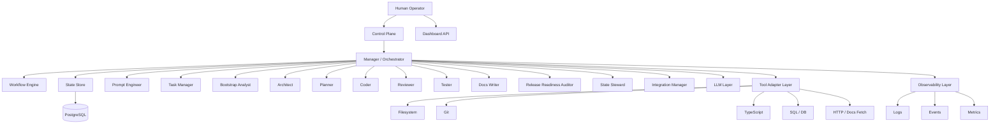
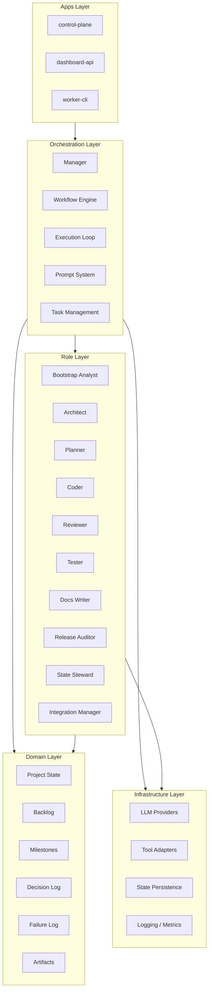
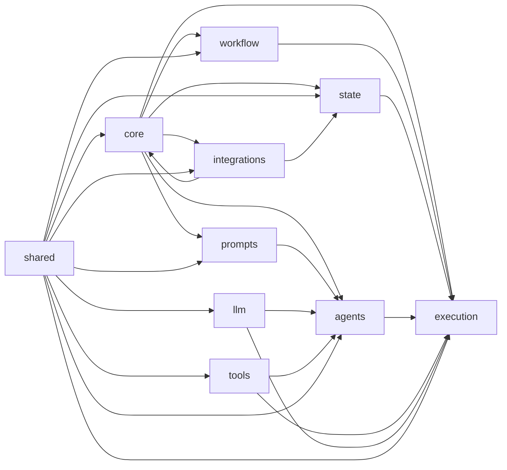
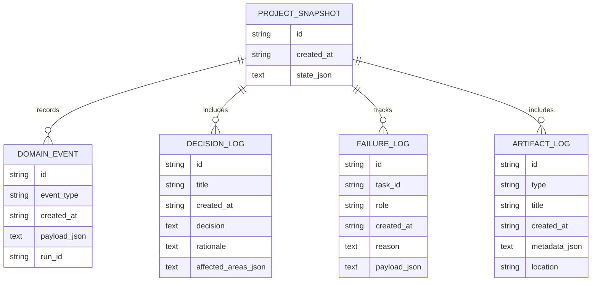
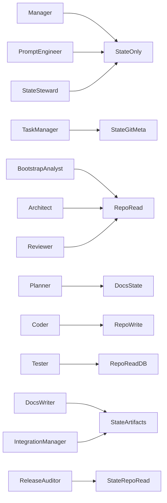
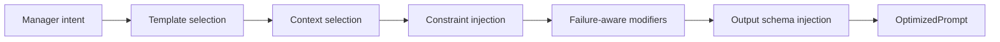
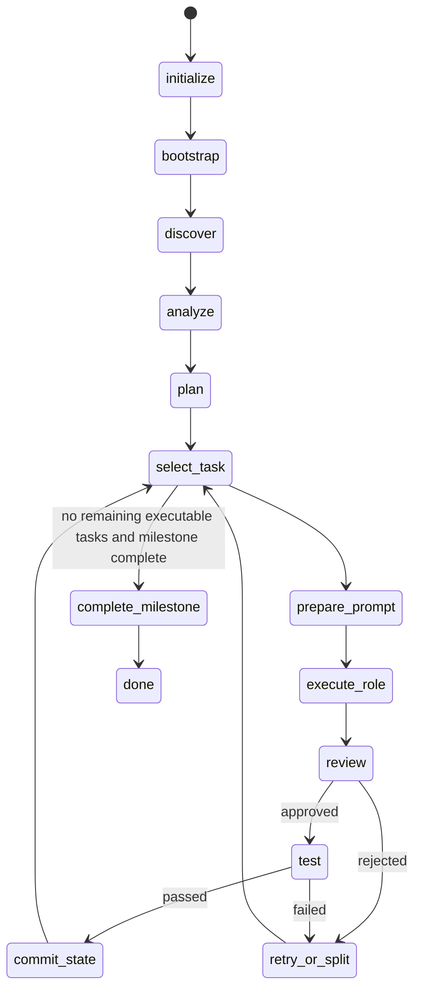
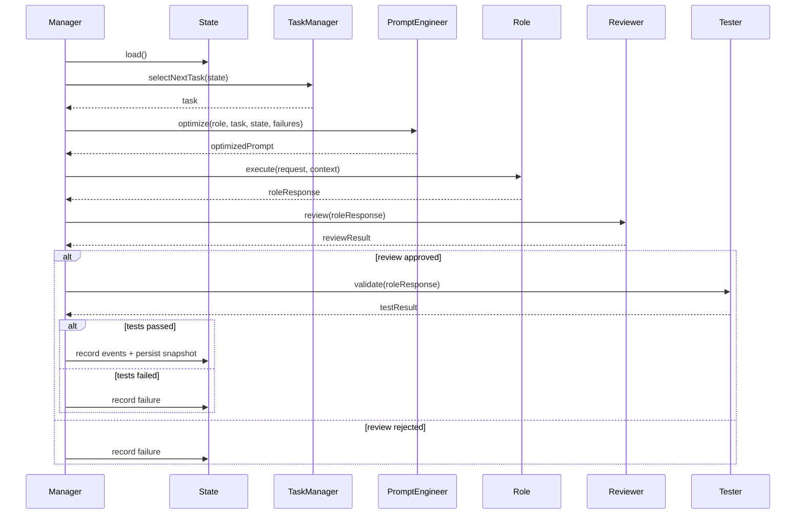
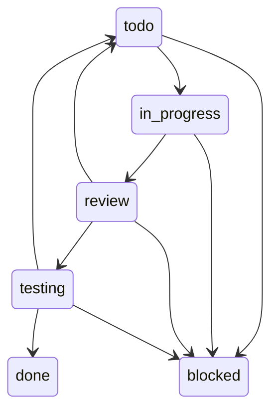

# AI Orchestrator — Full Technical Specification v3

**Status:** Draft v3  
**Document type:** Architecture and implementation specification  
**Audience:** architects, backend engineers, platform engineers, AI engineering teams  
**Format:** Markdown  
**Purpose:** review, editing, implementation planning, delivery handoff

---

# 1. Executive summary

This document defines a complete architecture and implementation specification for an **AI Orchestrator**: a backend system that coordinates multiple specialized AI roles to analyze work, plan execution, perform bounded tasks, review outputs, validate results, maintain state, and progress through milestones under explicit guardrails.

This is **not** a chatbot wrapper and **not** a generic “autonomous agent” in the vague sense. It is a **control plane** for structured AI-assisted execution.

The platform is designed to solve a recurring engineering problem:

- a large body of work must be executed incrementally
- the work needs planning, implementation, review, testing, and documentation
- outputs must be grounded in actual system state
- results must be traceable and recoverable
- failures must not cause uncontrolled loops
- autonomy must be bounded by policy

The orchestrator solves this through:

- a central **Manager / Orchestrator**
- specialized roles with explicit responsibilities
- a persistent **Project State**
- a formal **Workflow Engine**
- a dedicated **Prompt Engineer**
- a dedicated **Task Manager**
- tool adapters
- structured outputs
- review and testing gates
- retry, split, and escalation policies
- milestones and stop conditions
- auditability through events, decisions, and artifacts

This specification is intentionally detailed enough that implementation teams should not have to infer critical architectural or business rules.

---

# 2. Problem statement

Teams often try to solve multi-step AI automation with one of these approaches:

1. one giant prompt
2. one “smart agent” with broad permissions
3. ad hoc scripts around an LLM
4. a tool-using chat loop without durable state
5. a planner-coder-reviewer design without true orchestration policy

These approaches fail in predictable ways:

- role confusion
- self-approval
- loss of state between runs
- weak task decomposition
- no milestone model
- no auditable decisions
- repeated failures without adaptation
- prompt drift
- uncontrolled code changes
- insufficient validation
- inability to explain why something happened

The required system must therefore support:

- stateful execution
- explicit role boundaries
- bounded autonomy
- formal transitions
- artifact creation
- decision logging
- structured reviews
- structured testing
- incremental progress

---

# 3. Goals

## 3.1 Primary goals

The platform must:

- coordinate multiple AI roles under a single control plane
- maintain durable execution state
- convert findings into executable backlog items
- progress through milestones
- enforce review and validation gates
- record decisions, failures, and outputs
- support human intervention at defined boundaries
- support repository-aware and system-aware work
- remain extensible without rewriting the core

## 3.2 Secondary goals

The platform should:

- expose machine-readable and human-readable outputs
- support dashboards and reporting
- support export to external work systems
- support multiple LLM providers
- support multiple execution modes
- support reproducibility and replay where feasible

## 3.3 Non-goals for MVP

The initial implementation will not include:

- unrestricted autonomous execution without stop conditions
- direct merge or deployment automation
- distributed multi-node execution
- fully automatic external system mutation
- unrestricted self-modification of orchestration policy
- full multi-tenant enterprise hardening

---

# 4. Design principles

## 4.1 Explicit control beats vague autonomy

The orchestrator must not behave like an unbounded autonomous entity. It must follow deterministic policies wherever possible.

## 4.2 State is a first-class architectural concern

The system must persist state, not merely infer context from prompt history.

## 4.3 Roles must remain specialized

Planning, coding, reviewing, and testing must be separated so that each role can be evaluated independently.

## 4.4 All meaningful outputs must be structured

Critical role outputs must validate against explicit schemas.

## 4.5 Review and testing are gates, not suggestions

Non-trivial work must pass review and validation before being considered accepted.

## 4.6 Failure must produce adaptation

A failed run must inform retries, task splitting, or escalation. Failure cannot simply trigger the same action again without change.

## 4.7 Human intervention must be explicit

Escalation must produce a clear explanation of why the system stopped and what decision is required.

## 4.8 Architecture must remain layered

Domain, orchestration, and infrastructure boundaries must remain clear.

---

# 5. High-level architecture

## 5.1 Logical overview



## 5.2 Core execution rule

All non-trivial execution flows through the **Manager**. Roles do not communicate arbitrarily with one another. The Manager is the sole coordinator of:

- role invocation
- prompt preparation requests
- task routing
- review gating
- testing gating
- retries
- splitting
- escalation
- state commits

## 5.3 Why centralized orchestration is mandatory

Without centralized orchestration:

- roles start to duplicate responsibilities
- no single component owns progression logic
- retries become opaque
- state transitions become inconsistent
- the system becomes hard to debug

---

# 6. Architectural layers

## 6.1 Layer model



## 6.2 Layer rules

### Apps layer
May compose lower layers, but must not contain business rules beyond command/API wiring.

### Orchestration layer
Owns execution flow and policy. Must not be tightly coupled to a particular LLM provider or storage backend.

### Role layer
Implements specialized role behavior. Roles may consume domain types and infrastructure abstractions, but they do not own state transitions.

### Domain layer
Defines core entities, states, and contracts. Must not depend on infrastructure or concrete providers.

### Infrastructure layer
Implements persistence, tool access, provider access, logging, and metrics. Must not own orchestration policy.

---

# 7. Monorepo structure

```text
ai-orchestrator/
├─ package.json
├─ pnpm-workspace.yaml
├─ turbo.json
├─ tsconfig.base.json
├─ .editorconfig
├─ .gitignore
├─ .env.example
├─ README.md
├─ docs/
│  ├─ adr/
│  ├─ specs/
│  ├─ prompts/
│  ├─ diagrams/
│  └─ examples/
├─ apps/
│  ├─ control-plane/
│  │  ├─ package.json
│  │  ├─ tsconfig.json
│  │  └─ src/
│  │     ├─ index.ts
│  │     ├─ bootstrap.ts
│  │     ├─ composition/
│  │     │  └─ buildRuntime.ts
│  │     └─ commands/
│  │        ├─ runCycle.ts
│  │        ├─ runTask.ts
│  │        ├─ runMilestone.ts
│  │        ├─ showState.ts
│  │        ├─ showBacklog.ts
│  │        ├─ exportBacklog.ts
│  │        └─ exportSummary.ts
│  ├─ dashboard-api/
│  │  ├─ package.json
│  │  ├─ tsconfig.json
│  │  └─ src/
│  │     ├─ server.ts
│  │     ├─ routes/
│  │     │  ├─ state.ts
│  │     │  ├─ backlog.ts
│  │     │  ├─ milestones.ts
│  │     │  ├─ events.ts
│  │     │  ├─ failures.ts
│  │     │  ├─ decisions.ts
│  │     │  └─ runs.ts
│  │     └─ serializers/
│  │        └─ apiModels.ts
│  └─ worker-cli/
│     ├─ package.json
│     ├─ tsconfig.json
│     └─ src/
│        ├─ index.ts
│        └─ commands/
│           ├─ runRole.ts
│           └─ debugPrompt.ts
├─ packages/
│  ├─ core/
│  ├─ agents/
│  ├─ prompts/
│  ├─ workflow/
│  ├─ state/
│  ├─ llm/
│  ├─ tools/
│  ├─ execution/
│  ├─ integrations/
│  └─ shared/
└─ tests/
   ├─ unit/
   ├─ integration/
   └─ fixtures/
```

---

# 8. Package dependency rules

## 8.1 Dependency graph



## 8.2 Hard dependency rules

- `core` must not depend on `llm`, `tools`, `state`, or apps
- `workflow` must not depend on concrete tools
- `agents` must not depend on `execution`
- `execution` may depend on `workflow`, `state`, `agents`, `llm`, and `tools`
- `integrations` must not own orchestration logic
- apps may compose any package but should not redefine domain logic

---

# 9. Domain model

# 9.1 ProjectState

`ProjectState` is the central persisted state model.

## Responsibilities

It must represent:

- current repository/system summary
- architecture understanding
- active milestone
- backlog
- execution status
- recent and historical failures
- decisions
- artifacts
- repo/system health

## Example contract

```ts
export interface ProjectState {
  projectId: string;
  projectName: string;
  summary: string;
  currentMilestoneId?: string;

  architecture: {
    packageMap: string[];
    subsystemMap: string[];
    unstableAreas: string[];
    criticalPaths: string[];
  };

  repoHealth: {
    build: 'unknown' | 'ok' | 'failing';
    tests: 'unknown' | 'ok' | 'failing';
    lint: 'unknown' | 'ok' | 'failing';
    typecheck: 'unknown' | 'ok' | 'failing';
  };

  backlog: {
    epics: Epic[];
    features: Feature[];
    tasks: BacklogTask[];
  };

  execution: {
    activeTaskId?: string;
    activeRunId?: string;
    completedTaskIds: string[];
    blockedTaskIds: string[];
    retryCounts: Record<string, number>;
    stepCount: number;
  };

  milestones: Milestone[];
  decisions: DecisionLogItem[];
  failures: FailureRecord[];
  artifacts: ArtifactRecord[];
}
```

## Rules

- `activeTaskId` must reference a real task if defined
- `retryCounts` must reflect failure history
- `currentMilestoneId` must reference a valid milestone if defined
- blocked tasks must not be selected for execution
- completed tasks cannot return to `todo` without explicit reset or replay policy

---

# 9.2 Backlog model

## Epic

Represents a large goal area.

```ts
export interface Epic {
  id: string;
  title: string;
  goal: string;
  status: 'todo' | 'in_progress' | 'done' | 'blocked';
  featureIds: string[];
}
```

## Feature

Represents an outcome-oriented slice inside an epic.

```ts
export interface Feature {
  id: string;
  epicId: string;
  title: string;
  outcome: string;
  risks: string[];
  taskIds: string[];
}
```

## BacklogTask

Represents the smallest orchestrator-managed unit of work.

```ts
export interface BacklogTask {
  id: string;
  title: string;
  kind:
    | 'bootstrap_analysis'
    | 'analyze_architecture'
    | 'plan_backlog'
    | 'stabilize'
    | 'implement_change'
    | 'review_change'
    | 'write_tests'
    | 'run_validation'
    | 'update_docs'
    | 'assess_release'
    | 'repair_state'
    | 'prepare_export';

  status:
    | 'todo'
    | 'in_progress'
    | 'review'
    | 'testing'
    | 'done'
    | 'blocked';

  priority: 'p0' | 'p1' | 'p2' | 'p3';
  epicId?: string;
  featureId?: string;
  dependsOn: string[];
  acceptanceCriteria: string[];
  affectedModules: string[];
  estimatedRisk: 'low' | 'medium' | 'high';
  ownerRole?: AgentRoleName;
}
```

## Task rules

- every task must have acceptance criteria
- every task must have a kind
- every task must identify affected modules when relevant
- every task with dependencies must only run when those dependencies are satisfied
- blocked tasks require explicit reason in an associated artifact or failure entry

---

# 9.3 Milestone model

```ts
export interface Milestone {
  id: string;
  title: string;
  goal: string;
  status: 'todo' | 'in_progress' | 'done' | 'blocked';
  epicIds: string[];
  entryCriteria: string[];
  exitCriteria: string[];
}
```

## Milestone rules

- only one milestone may be `in_progress` at a time in MVP
- milestone completion requires all mandatory exit criteria to be satisfied
- blocked milestones require at least one escalation record

---

# 9.4 Decision log

```ts
export interface DecisionLogItem {
  id: string;
  title: string;
  decision: string;
  rationale: string;
  affectedAreas: string[];
  createdAt: string;
}
```

## Rules

- decisions must capture the “why”, not only the “what”
- decisions should be created when architecture or workflow direction changes
- decisions must be immutable after creation; corrections must be new entries

---

# 9.5 Failure record

```ts
export interface FailureRecord {
  id: string;
  taskId: string;
  role: AgentRoleName;
  reason: string;
  symptoms: string[];
  badPatterns: string[];
  retrySuggested: boolean;
  createdAt: string;
}
```

## Rules

- every execution failure that affects progression must be recorded
- failures should influence retry prompt constraints
- repeated failures must affect task selection and escalation

---

# 9.6 Artifact record

```ts
export interface ArtifactRecord {
  id: string;
  type:
    | 'summary'
    | 'report'
    | 'export'
    | 'architecture_findings'
    | 'plan'
    | 'test_plan'
    | 'release_assessment'
    | 'integrity_report';

  title: string;
  location?: string;
  metadata: Record<string, string>;
  createdAt: string;
}
```

---

# 10. State persistence design

## 10.1 Persistence strategy

The system uses:

- event log for auditability
- snapshots for fast recovery
- structured tables for operational reporting

MVP persistence backend:
- PostgreSQL

Post-MVP backend:
- PostgreSQL

## 10.2 ER diagram



## 10.3 Required tables

### `project_snapshots`
Stores the serialized state at checkpoints.

### `domain_events`
Stores events such as task selection, review rejection, and milestone completion.

### `decision_log`
Stores important execution or architecture decisions.

### `failure_log`
Stores failure history and repeated bad patterns.

### `artifact_log`
Stores references to generated reports, plans, exports, and summaries.

## 10.4 Snapshot policy

The system should snapshot:

- after bootstrap
- after task completion
- after milestone completion
- after significant repair actions
- optionally after every cycle in MVP

## 10.5 Event policy

Events must be recorded for:

- bootstrap completion
- repository discovery
- architecture analysis
- backlog planning
- task selection
- prompt generation
- role execution
- review pass/fail
- test pass/fail
- task completion
- task split
- task blocked
- milestone completion
- state integrity checks
- exports

---

# 11. Roles

# 11.1 Role inventory

| Role | Responsibility |
|---|---|
| Manager | overall orchestration and progression |
| Prompt Engineer | role-specific prompt construction |
| Task Manager | backlog normalization, milestones, dependencies |
| Bootstrap Analyst | initial repository/system understanding |
| Architect | architecture findings |
| Planner | roadmap and task decomposition |
| Coder | bounded implementation |
| Reviewer | correctness and architecture gate |
| Tester | validation and test design |
| Docs Writer | technical documentation generation |
| Release Readiness Auditor | release/stability assessment |
| State Steward | state integrity validation and repair guidance |
| Integration Manager | export payload preparation |

## 11.2 Tool access profiles



### Tool profile table

| Role | Filesystem | Git | TypeScript | SQL/DB | HTTP/Docs | State |
|---|---:|---:|---:|---:|---:|---:|
| Manager | no | no | no | no | no | yes |
| Prompt Engineer | no | no | no | no | no | yes |
| Task Manager | no | metadata only | no | no | no | yes |
| Bootstrap Analyst | yes read | yes read | yes read | optional | optional | yes |
| Architect | yes read | yes read | yes read | optional | yes | yes |
| Planner | no | no | no | no | yes | yes |
| Coder | yes read/write | yes read | yes read | optional | optional | yes |
| Reviewer | yes read | yes read | yes read | optional | optional | yes |
| Tester | yes read | yes read | yes read | yes | optional | yes |
| Docs Writer | no | optional read | no | no | no | yes |
| Release Auditor | yes read | yes read | yes read | optional | optional | yes |
| State Steward | no | no | no | no | no | yes |
| Integration Manager | no | no | no | no | no | yes |

## 11.3 Role contract

```ts
export interface AgentRole<TInput = unknown, TOutput = unknown> {
  name: AgentRoleName;
  buildRequest(input: TInput, ctx: RoleExecutionContext): RoleRequest<TInput>;
  execute(
    request: RoleRequest<TInput>,
    ctx: RoleExecutionContext
  ): Promise<RoleResponse<TOutput>>;
  validate?(response: RoleResponse<TOutput>): Promise<boolean>;
}
```

## 11.4 Shared role rules

All roles must:

- return structured output
- state confidence where appropriate
- include warnings and risks
- avoid mutating orchestration state directly
- avoid owning workflow transitions
- respect tool profile boundaries

---

# 12. Prompt system

## 12.1 Prompt system purpose

The prompt system exists to:

- convert high-level managerial intent into role-specific instructions
- reduce ambiguity
- inject task constraints
- apply failure-aware modifications
- ensure consistent output schemas
- reduce token waste

## 12.2 Prompt artifact model

```ts
export interface OptimizedPrompt {
  targetRole: AgentRoleName;
  systemPrompt: string;
  taskPrompt: string;
  outputSchema: string;
  constraints: string[];
  rationale: string;
}
```

## 12.3 Prompt construction pipeline



## 12.4 Prompt construction rules

- minimal sufficient context only
- role-specific vocabulary
- acceptance criteria always included
- prior failures become retry constraints
- anti-patterns included for high-risk tasks
- output schema explicitly named and described

## 12.5 Anti-pattern examples

For Coder:
- do not broaden scope beyond assigned modules
- do not introduce `any` without explicit justification
- do not change public API unless task requires it

For Reviewer:
- do not silently approve uncertain outputs
- classify blockers vs non-blockers

For Planner:
- do not create vague tasks
- dependencies must be explicit

For Tester:
- do not claim validation without scenarios or evidence

---

# 13. Workflow engine

## 13.1 Purpose

The Workflow Engine owns progression policy.

It decides:

- whether execution can continue
- which task kinds map to which roles
- whether a task should retry, split, or block
- whether the run should stop
- whether a milestone is complete

## 13.2 Stage model

```ts
export type WorkflowStage =
  | 'initialize'
  | 'bootstrap'
  | 'discover'
  | 'analyze'
  | 'plan'
  | 'select_task'
  | 'prepare_prompt'
  | 'execute_role'
  | 'review'
  | 'test'
  | 'commit_state'
  | 'retry_or_split'
  | 'complete_milestone'
  | 'blocked'
  | 'needs_human'
  | 'done';
```

## 13.3 Stage machine



## 13.4 Retry policy

Default:
- first failure: retry with stronger prompt
- second failure: split task
- third failure: block and escalate

## 13.5 Stop conditions

A run must stop when:

- milestone is complete
- `maxStepsPerRun` reached
- same task failed 3 times
- repository/system health degraded materially
- state integrity is uncertain
- a human decision is required

## 13.6 Task router

Example mapping:

| Task kind | Target role |
|---|---|
| `bootstrap_analysis` | Bootstrap Analyst |
| `analyze_architecture` | Architect |
| `plan_backlog` | Planner |
| `stabilize` | Coder |
| `implement_change` | Coder |
| `review_change` | Reviewer |
| `write_tests` | Tester |
| `run_validation` | Tester |
| `update_docs` | Docs Writer |
| `assess_release` | Release Readiness Auditor |
| `repair_state` | State Steward |
| `prepare_export` | Integration Manager |

---

# 14. Execution lifecycle

## 14.1 Cycle sequence



## 14.2 Detailed cycle steps

1. load current state
2. evaluate stop conditions
3. resolve active milestone
4. select next executable task
5. determine role
6. prepare role prompt
7. execute role
8. validate schema of result
9. run review
10. if approved, run testing
11. if testing passes, commit state
12. if not, record failure and determine retry/split/escalation

## 14.3 Run modes

### Single-cycle mode
Runs exactly one cycle. Best for safe debugging.

### Run-task mode
Runs a selected task directly if policy allows.

### Run-milestone mode
Runs repeatedly until:
- milestone complete
- stop condition
- escalation

### Assisted-auto mode
Same as run-milestone, but with stricter configured caps.

---

# 15. Phases — exhaustive description

# 15.1 Phase 0 — Initialization

## Purpose
Prepare runtime dependencies and baseline config.

## Inputs
- environment configuration
- repository root or project target
- provider configuration
- persistence configuration

## Actions
- validate config
- build logger
- build state store
- build tool adapters
- build LLM client
- register roles
- build workflow engine
- load or initialize state

## Outputs
- initialized runtime
- loaded state or empty state baseline

## Failure cases
- invalid config
- unsupported provider
- DB unavailable
- missing repository root

## Handling
- hard fail before execution starts

---

# 15.2 Phase 1 — Bootstrap

## Purpose
Create the first meaningful state from a target system.

## Inputs
- initialized runtime
- empty or partial state
- repository/system root

## Actions
- run Bootstrap Analyst
- inventory top-level structure
- identify likely subsystems
- capture initial health observations
- create initial milestone recommendations
- persist snapshot and events

## Outputs
- first durable state
- package/system inventory artifact
- active initial milestone

## Edge cases
- repository unreadable
- incomplete manifests
- partial source tree

## Rules
- bootstrap does not propose broad changes
- bootstrap may identify obvious hotspots but not deeply redesign

---

# 15.3 Phase 2 — Repository / System Discovery

## Purpose
Understand the shape of the work target before attempting architecture or task planning.

## Inputs
- filesystem or other system description
- manifests
- source tree
- tool diagnostics

## Actions
- identify packages/modules
- identify entry points
- identify tooling structure
- identify critical paths
- identify obvious unstable areas
- collect baseline diagnostics

## Outputs
- package map
- subsystem map
- critical path list
- unstable area candidates

## Rules
- discovery must remain descriptive, not speculative
- generated code directories may need filtering
- discovery output must be reusable by Architect and Planner

---

# 15.4 Phase 3 — Architecture Analysis

## Purpose
Produce grounded architecture findings.

## Inputs
- discovery output
- dependency graph
- diagnostics
- docs or design notes if available

## Actions
- detect cycles
- detect layering violations
- detect leaky abstractions
- detect overcoupling
- detect unstable boundaries
- classify severity
- produce findings artifact

## Outputs
- `ArchitectureFinding[]`
- architecture risk summary
- backlog candidates

## Rules
- findings must reference real evidence
- broad rewrite recommendations require strong rationale
- uncertainty must be stated explicitly

---

# 15.5 Phase 4 — Backlog and milestone planning

## Purpose
Turn findings into executable work.

## Inputs
- architecture findings
- health state
- unresolved failures
- prior roadmap

## Actions
- define milestones
- define epics
- define features
- define tasks
- set priorities
- set dependencies
- define acceptance criteria

## Outputs
- normalized backlog
- active milestone
- executable task graph

## Rules
- no task without acceptance criteria
- stabilization work outranks feature work
- work that unblocks other work should be preferred
- broad tasks should be split early

---

# 15.6 Phase 5 — Task selection

## Purpose
Select the best executable task.

## Inputs
- active milestone
- backlog
- completed tasks
- blocked tasks
- retry history

## Actions
- filter by milestone
- filter by dependency satisfaction
- exclude blocked
- order by priority
- adjust for retry history
- adjust for unblock value
- select role owner

## Outputs
- selected task
- assigned role
- selection rationale

## Rules
- blocked tasks never auto-run
- repeatedly failing tasks must not starve the rest of the backlog, but may be deprioritized
- no task selection if milestone graph is invalid

---

# 15.7 Phase 6 — Prompt preparation

## Purpose
Create execution instructions precise enough to reduce low-quality outputs.

## Inputs
- selected task
- role
- constraints
- state context
- prior failures

## Actions
- choose role template
- choose task template
- inject constraints
- inject failure-aware anti-patterns
- inject schema specification
- produce `OptimizedPrompt`

## Outputs
- optimized prompt artifact

## Rules
- minimal context only
- role-specific scope
- must mention acceptance criteria
- must mention output structure

---

# 15.8 Phase 7 — Role execution

## Purpose
Perform the work assigned to the selected role.

## Inputs
- role request
- execution context
- tool profile
- optimized prompt

## Actions
- invoke provider
- optionally invoke tools
- collect structured result
- validate schema
- attach warnings and risks

## Outputs
- `RoleResponse<T>`

## Rules
- invalid schema outputs are rejected or repaired once
- role must not update state directly
- role must remain within its tool profile

---

# 15.9 Phase 8 — Review

## Purpose
Determine whether the role result is acceptable.

## Inputs
- role response
- task
- current architecture constraints
- project rules

## Actions
- inspect correctness
- inspect scope containment
- inspect architecture fit
- identify blockers
- identify non-blockers
- identify missing tests

## Outputs
- `ReviewResult`

## Rules
- any blocker means approval = false
- ambiguity is treated conservatively
- missing tests for behavior change must be noted

---

# 15.10 Phase 9 — Testing

## Purpose
Validate the result behaviorally.

## Inputs
- role response
- review result
- task
- tool access

## Actions
- derive or refine test plan
- run validations where configured
- detect failures
- detect missing coverage
- classify pass/fail

## Outputs
- `TestExecutionResult`

## Rules
- behavior changes require validation
- inability to validate must be explicit
- provisional pass should be opt-in and low risk only

---

# 15.11 Phase 10 — Commit state

## Purpose
Persist accepted progress.

## Inputs
- prior state
- task
- role result
- review result
- test result

## Actions
- emit domain events
- update task status
- update retry counts
- update health if relevant
- attach artifacts
- snapshot state

## Outputs
- new durable state
- run summary

## Rules
- state commit must be atomic at application level
- task completion must be idempotent
- invalid state transitions must be rejected

---

# 15.12 Phase 11 — Retry / split / escalate

## Purpose
Adapt to failure.

## Inputs
- failure record
- retry counts
- task scope
- review/test reasons

## Actions
- strengthen prompt for retry
- split task if too broad
- block and escalate if unresolved

## Outputs
- updated task graph
- escalation record if needed

## Rules
- do not repeat the same failed execution blindly
- second attempt must meaningfully differ
- escalation must explain why autonomy stopped

---

# 15.13 Phase 12 — Milestone completion

## Purpose
Close a milestone cleanly and activate the next.

## Inputs
- milestone
- backlog
- unresolved failures
- optional release readiness result

## Actions
- verify exit criteria
- generate summary
- mark milestone done
- activate next milestone

## Outputs
- milestone completion record
- summary artifact
- updated roadmap state

---

# 16. Milestones

These milestones are generic milestone classes the orchestrator should support. Concrete projects may rename them, but the progression model is stable.

## 16.1 Milestone A — Stabilization

### Goal
Make the target system sufficiently stable for structured progress.

### Typical scope
- compile failures
- invalid references
- broken imports
- obvious runtime hazards
- missing glue code
- execution blockers

### Exit criteria
- hard blockers materially reduced
- baseline health improved
- critical paths unblocked

## 16.2 Milestone B — Critical path correctness

### Goal
Make the main execution path reliable enough for meaningful development.

### Typical scope
- provider path
- core execution path
- translation/generation path
- transaction path
- critical APIs
- key data mappings

### Exit criteria
- critical path tasks complete
- review confirms correctness baseline
- validation confirms critical path behavior

## 16.3 Milestone C — Validation baseline

### Goal
Establish confidence mechanisms.

### Typical scope
- unit tests
- integration tests
- snapshots
- regression coverage
- validation workflow consistency

### Exit criteria
- critical path changes have validation
- test planning is standard output
- regression protection materially improved

## 16.4 Milestone D — Architecture hardening

### Goal
Reduce medium-term maintenance risk.

### Typical scope
- boundary cleanup
- contract extraction
- dependency cleanup
- extension points
- removing stabilization compromises

### Exit criteria
- architecture findings materially reduced
- boundaries clearer
- future changes safer

## 16.5 Milestone E — Feature expansion

### Goal
Resume forward growth safely.

### Typical scope
- net new features
- ergonomics
- DX
- advanced behavior
- additional integrations

### Exit criteria
- features ship on stable foundations
- no repeated destabilization of earlier milestones

---

# 17. Business logic

# 17.1 Task status transitions

Allowed transitions:



## Rules
- transitions outside the allowed set are invalid
- `done` is terminal unless explicit reset or replay policy applies
- `blocked` must carry reason metadata

---

# 17.2 Priority policy

## Priority levels

- `p0`: hard blockers, critical path blockers, safety issues
- `p1`: high-value enabling work
- `p2`: important but not immediately blocking work
- `p3`: cleanup, polish, deferred items

## Tie-break rules

If same priority:
1. more dependency-unblocking value first
2. lower risk first
3. smaller bounded scope first
4. older deferred task first

---

# 17.3 Review policy

Review is mandatory when:
- code changed
- runtime behavior changed
- public API may have changed
- migration or data logic changed
- critical path was touched

Review may be skipped only for:
- documentation-only exports
- pure reporting artifacts
- pure state inspection with no behavioral effect

---

# 17.4 Testing policy

Testing is mandatory when:
- role output changes behavior
- code changes are accepted
- critical path changes occurred
- integration behavior may be affected

Testing may be reduced only when:
- no executable environment exists
- risk is low
- a follow-up validation task is created
- policy allows provisional acceptance

---

# 17.5 Retry policy

Default:
- failure 1 → retry with strengthened prompt
- failure 2 → split
- failure 3 → block and escalate

Retries must change at least one of:
- prompt constraints
- task scope
- context selection
- validation requirements

---

# 17.6 Escalation policy

Escalate when:
- product ambiguity blocks execution
- architecture ambiguity has high cost
- repeated state inconsistency occurs
- task graph is invalid
- run caps are reached without useful progress
- safety policy blocks further action

Escalation output must include:
- summary of blocking issue
- why automation stopped
- what decision is required
- affected tasks or milestones

---

# 18. Cases and scenarios

# 18.1 Happy path

1. Manager loads state
2. Task Manager selects executable task
3. Prompt Engineer prepares prompt
4. Target role executes
5. Reviewer approves
6. Tester passes
7. Manager commits state
8. Run summary is produced

## Expected outputs
- task status becomes `done`
- snapshot recorded
- events recorded
- any artifact references attached

---

# 18.2 Reviewer rejection path

1. Task selected
2. Role executes
3. Reviewer identifies blocker
4. Approval = false
5. Failure recorded
6. Retry policy triggered

## Expected outputs
- no state commit for task completion
- retry count increments
- prompt constraints strengthened next time

---

# 18.3 Tester failure path

1. Review approved
2. Tester detects failure
3. Failure recorded
4. Task either retries or splits

## Expected outputs
- task not marked done
- validation failure reason attached
- follow-up test-related tasks possible

---

# 18.4 Task split path

1. Task repeatedly fails or produces broad churn
2. Task Manager splits it into narrower tasks
3. Original task becomes blocked or superseded
4. New subtasks are inserted

## Expected outputs
- improved scope clarity
- better role prompts
- lower blast radius in subsequent cycles

---

# 18.5 No executable task path

1. Active milestone exists
2. No task is executable due to dependency or blocked status
3. Task Manager attempts repair
4. If repair impossible, escalation occurs

---

# 18.6 State corruption path

1. State load reveals invalid reference
2. State Steward validates integrity
3. Repair recommendations produced
4. Manager either applies safe repair or escalates

---

# 18.7 Milestone completion path

1. No remaining required tasks
2. Exit criteria checked
3. Optional release readiness role runs
4. Summary artifact generated
5. Milestone status becomes `done`
6. Next milestone activated

---

# 18.8 Export preparation path

1. Milestone summary complete
2. Integration Manager maps tasks/features/epics to export models
3. Missing fields are identified
4. Export either succeeds or blocks with explanation

---

# 19. API contracts

# 19.1 Dashboard API goals

Expose read-only operational insight for humans and systems.

## 19.2 Endpoints

### `GET /state`
Returns current state summary.

Example:
```json
{
  "currentMilestoneId": "m1",
  "activeTaskId": "task-12",
  "repoHealth": {
    "build": "ok",
    "tests": "failing",
    "lint": "unknown",
    "typecheck": "ok"
  }
}
```

### `GET /backlog`
Returns structured backlog.

### `GET /milestones`
Returns milestone list and statuses.

### `GET /events`
Returns recent domain events.

### `GET /failures`
Returns recent failures.

### `GET /decisions`
Returns decision log entries.

### `GET /runs/latest`
Returns latest run summary.

## 19.3 API rules

- read-only in MVP
- serializers must not leak internal provider secrets
- state should be summarized for heavy payloads

---

# 20. CLI contracts

## 20.1 Control-plane CLI

```text
control-plane bootstrap
control-plane run-cycle
control-plane run-task <task-id>
control-plane run-milestone <milestone-id>
control-plane show-state
control-plane show-backlog
control-plane export-backlog
control-plane export-summary
```

## 20.2 Worker CLI

```text
worker-cli run-role <role>
worker-cli debug-prompt <task-id> <role>
```

## 20.3 CLI rules

- commands must return non-zero exit codes on orchestrator failures
- commands should output machine-readable JSON optionally
- commands must not bypass workflow policy without explicit debug flags

---

# 21. Tool adapter model

## 21.1 Purpose

Tool adapters isolate external operations from business logic.

## 21.2 Adapter contracts

### FilesystemTool

```ts
export interface FileSystemTool {
  readFile(path: string): Promise<string>;
  writeFile(path: string, content: string): Promise<void>;
  listFiles(path: string): Promise<string[]>;
  exists(path: string): Promise<boolean>;
}
```

### GitTool

```ts
export interface GitTool {
  status(): Promise<string>;
  diff(args?: { staged?: boolean }): Promise<string>;
  currentBranch(): Promise<string>;
}
```

### TypeScriptTool

```ts
export interface TypeScriptTool {
  check(): Promise<{ ok: boolean; diagnostics: string[] }>;
  diagnostics(): Promise<string[]>;
}
```

### SqlTool

```ts
export interface SqlTool {
  runQuery(sql: string): Promise<{ rows: unknown[] }>;
  explainQuery(sql: string): Promise<string>;
}
```

### DocsTool

```ts
export interface DocsTool {
  fetch(url: string): Promise<string>;
}
```

## 21.3 Tool rules

- tools must return typed outputs
- tools must sanitize execution
- roles must not exceed tool profiles
- write actions must be scope-limited

---

# 22. Observability

## 22.1 Logs

Required log events:
- cycle_start
- cycle_end
- task_selected
- prompt_generated
- role_executed
- review_result
- test_result
- state_committed
- retry_triggered
- task_split
- escalation_created

## 22.2 Metrics

MVP may record basic metrics only.

Post-MVP metrics:
- tasks completed by role
- average retries per task kind
- average cycle duration
- blocker categories
- test failure rate
- approval rate by role

## 22.3 Domain events

Required event types:
- `BOOTSTRAP_COMPLETED`
- `DISCOVERY_COMPLETED`
- `ARCHITECTURE_ANALYZED`
- `BACKLOG_PLANNED`
- `TASK_SELECTED`
- `PROMPT_GENERATED`
- `ROLE_EXECUTED`
- `REVIEW_APPROVED`
- `REVIEW_REJECTED`
- `TEST_PASSED`
- `TEST_FAILED`
- `TASK_COMPLETED`
- `TASK_SPLIT`
- `TASK_BLOCKED`
- `MILESTONE_COMPLETED`
- `STATE_INTEGRITY_CHECKED`
- `EXPORT_PREPARED`

---

# 23. Security and safety

## 23.1 Core safety goals

- prevent uncontrolled writes
- prevent self-approval
- prevent infinite loops
- prevent hidden state mutation
- prevent unsafe escalation bypass

## 23.2 Safety rules

- Coder cannot approve work
- Reviewer cannot modify work
- Tester cannot modify work
- tasks cannot skip review when code changed
- tasks cannot skip testing when behavior changed
- state must not be silently repaired without record
- retries must be capped

## 23.3 Write scoping

Allowed write scope in implementation environments should be configurable and limited to target work areas.

## 23.4 Provider safety

- provider configuration must be explicit
- secrets must not be logged
- provider errors must be sanitized

---

# 24. MVP scope

## 24.1 MVP must include

### Core packages
- `core`
- `workflow`
- `state`
- `llm`
- `prompts`
- `agents`
- `execution`
- `shared`

### Apps
- `control-plane`

### Roles
- Manager
- Prompt Engineer
- Task Manager
- Coder
- Reviewer
- Tester

### State
- in-memory store
- PostgreSQL store
- snapshots
- events

### Workflow
- task routing
- retry policy
- stop conditions
- cycle execution

### CLI
- bootstrap
- run-cycle
- show-state
- export-backlog

### Prompt system
- templates for primary roles
- failure-aware prompt modifications

### Observability
- logs
- run summaries

## 24.2 MVP success criteria

- runtime boots successfully
- state initializes correctly
- a task can be selected
- prompt can be generated
- role can execute
- review and test loop runs
- state commits on success
- failures are recorded on rejection/failure
- backlog export works

---

# 25. Post-MVP roadmap

## 25.1 Near-term

- Bootstrap Analyst
- Architect
- Planner
- task splitting automation
- Docs Writer
- Release Readiness Auditor
- State Steward
- Integration Manager

## 25.2 Mid-term

- dashboard API
- richer repo analysis
- richer diagnostics
- PostgreSQL state backend
- better TypeScript server integration
- more granular health tracking

## 25.3 Long-term

- distributed workers
- queue-backed execution
- safe parallel task execution
- advanced policy engines
- multi-project support
- deeper analytics and replay

---

# 26. Implementation plan

## Step 1 — Domain foundation
Implement:
- domain types
- backlog model
- milestones
- role contracts
- output contracts

## Step 2 — State and persistence
Implement:
- in-memory store
- PostgreSQL store
- events
- snapshots
- serializers

## Step 3 — Workflow
Implement:
- workflow engine
- stop conditions
- retry policy
- task router
- milestone policy

## Step 4 — Prompt system
Implement:
- templates
- registry
- constraint builder
- failure-aware modifiers

## Step 5 — Primary roles
Implement:
- Manager
- Prompt Engineer
- Task Manager
- Coder
- Reviewer
- Tester

## Step 6 — Execution runtime
Implement:
- orchestrator
- execution loop
- context factory
- run reporter

## Step 7 — Tools and providers
Implement:
- mock LLM
- real LLM adapters
- filesystem tool
- git tool
- TypeScript tool
- SQL tool

## Step 8 — Secondary roles
Implement:
- Bootstrap Analyst
- Architect
- Planner
- Docs Writer
- Release Auditor
- State Steward
- Integration Manager

## Step 9 — API and exports
Implement:
- dashboard API
- exporters
- summaries

---

# 27. Example starter code

## 27.1 LLM client

```ts
export interface LlmClient {
  generateStructured<T>(input: {
    systemPrompt: string;
    userPrompt: string;
    schemaName: string;
    temperature?: number;
  }): Promise<T>;
}
```

## 27.2 State store

```ts
export interface StateStore {
  load(): Promise<ProjectState>;
  save(state: ProjectState): Promise<void>;
  recordEvent(event: DomainEvent): Promise<void>;
  recordFailure(taskId: string, role: AgentRoleName, reason: string): Promise<void>;
  markTaskDone(taskId: string, summary: string): Promise<void>;
}
```

## 27.3 Prompt engineer

```ts
export class PromptEngineerAgent {
  constructor(private readonly llm: LlmClient) {}

  async optimize(input: {
    role: AgentRoleName;
    task: BacklogTask;
    projectState: ProjectState;
    priorFailures?: FailureRecord[];
  }): Promise<OptimizedPrompt> {
    return this.llm.generateStructured<OptimizedPrompt>({
      systemPrompt: 'PROMPT_ENGINEER_SYSTEM_PROMPT',
      userPrompt: [
        `Role: ${input.role}`,
        `Task: ${input.task.title}`,
        `Task kind: ${input.task.kind}`,
        `Acceptance: ${input.task.acceptanceCriteria.join('; ')}`,
        `Affected modules: ${input.task.affectedModules.join(', ')}`,
        `Prior failures: ${input.priorFailures?.map(f => f.reason).join(' | ') ?? 'none'}`
      ].join('\n'),
      schemaName: 'OptimizedPrompt',
      temperature: 0.2,
    });
  }
}
```

## 27.4 Task manager

```ts
export class TaskManagerAgent {
  selectNextTask(state: ProjectState): BacklogTask | undefined {
    const completed = new Set(state.execution.completedTaskIds);
    const blocked = new Set(state.execution.blockedTaskIds);

    return state.backlog.tasks
      .filter(task => task.status === 'todo')
      .filter(task => !blocked.has(task.id))
      .filter(task => task.dependsOn.every(dep => completed.has(dep)))
      .sort((a, b) => priorityWeight(a.priority) - priorityWeight(b.priority))[0];
  }
}
```

## 27.5 Orchestrator

```ts
export class Orchestrator {
  constructor(
    private readonly stateStore: StateStore,
    private readonly roleRegistry: RoleRegistry,
    private readonly promptEngineer: PromptEngineerAgent,
    private readonly taskManager: TaskManagerAgent,
    private readonly workflow: WorkflowEngine
  ) {}

  async runCycle(): Promise<void> {
    const state = await this.stateStore.load();

    if (this.workflow.shouldStop(state)) {
      return;
    }

    const task = this.taskManager.selectNextTask(state);
    if (!task) {
      return;
    }

    const role = this.workflow.routeTask(task);

    const optimizedPrompt = await this.promptEngineer.optimize({
      role,
      task,
      projectState: state,
      priorFailures: state.failures.filter(f => f.taskId === task.id),
    });

    const agent = this.roleRegistry.get(role);

    const result = await agent.execute(
      {
        role,
        objective: task.title,
        input: { task, prompt: optimizedPrompt },
        acceptanceCriteria: task.acceptanceCriteria,
        expectedOutputSchema: optimizedPrompt.outputSchema,
      },
      this.workflow.buildExecutionContext(state, task, role)
    );

    const reviewer = this.roleRegistry.get('reviewer');
    const review = await reviewer.execute(
      {
        role: 'reviewer',
        objective: `Review task ${task.title}`,
        input: result,
        expectedOutputSchema: 'ReviewResult',
      },
      this.workflow.buildExecutionContext(state, task, 'reviewer')
    );

    if (!review.output.approved) {
      await this.stateStore.recordFailure(task.id, 'reviewer', review.summary);
      return;
    }

    const tester = this.roleRegistry.get('tester');
    const test = await tester.execute(
      {
        role: 'tester',
        objective: `Test task ${task.title}`,
        input: result,
        expectedOutputSchema: 'TestExecutionResult',
      },
      this.workflow.buildExecutionContext(state, task, 'tester')
    );

    if (!test.output.passed) {
      await this.stateStore.recordFailure(task.id, 'tester', test.summary);
      return;
    }

    await this.stateStore.markTaskDone(task.id, result.summary);
  }
}
```

---

# 28. Open questions for implementation review

These are not unresolved spec gaps; they are conscious implementation choices that must be confirmed by the implementation team:

- which LLM provider(s) are first-class for MVP
- whether PostgreSQL snapshot frequency is every cycle or only on accepted progress
- whether provisional test pass exists in MVP
- whether `dashboard-api` is MVP or post-MVP
- whether `worker-cli` ships in MVP or post-MVP
- whether state replay is supported in MVP

---

# 29. Acceptance criteria for this specification

This specification is complete enough when an implementation team can derive:

- monorepo layout
- package boundaries
- state model
- workflow model
- role design
- prompt design
- API and CLI surfaces
- persistence model
- milestone model
- retry and escalation behavior
- MVP and post-MVP scope
- starter implementation path

---

# 30. Final conclusion

This v3 specification defines an **AI Orchestrator** as a structured, stateful, policy-driven orchestration backend.

It is intentionally designed to be:

- explicit instead of magical
- stateful instead of prompt-history-dependent
- role-separated instead of monolithic
- auditable instead of opaque
- milestone-driven instead of aimless
- guardrailed instead of unbounded

A team implementing this document should be able to build the platform without needing to invent major missing business rules or system boundaries.
