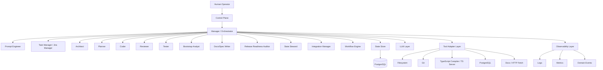

# AI Orchestrator for `ts-linq` — Full Technical Specification

**Status:** Draft v1  
**Authoring perspective:** Senior TypeScript Backend Architect  
**Target project:** Internal orchestration platform for AI-managed development of `ts-linq`  
**Document type:** Technical specification  
**Format:** Markdown  
**Intended use:** Review, editing, implementation planning, delivery handoff

---

# 1. Executive Summary

This document specifies the full implementation of an internal **AI orchestration backend** for the `ts-linq` project.

The system is designed to coordinate a set of specialized software-engineering roles as structured agents, under the supervision of a central **Manager / Orchestrator**. The platform is not a generic chatbot wrapper. It is an **engineering control plane** intended to operate over a repository, maintain project state, plan work, execute bounded tasks, review outcomes, validate behavior, and progress through milestones with strict guardrails.

The system is purpose-built for:

- repository stabilization
- architecture-guided delivery
- PostgreSQL-first framework development
- incremental, auditable execution
- backlog-driven work decomposition
- controlled autonomy
- prevention of broad, unsafe rewrites

This specification covers:

- architecture
- domain model
- runtime behavior
- file structure
- packages
- prompts
- agents
- workflow phases
- business logic
- cases and scenarios
- persistence
- tech stack
- MVP scope
- post-MVP roadmap
- milestones
- risks
- observability
- implementation sequence

---

# 2. Problem Statement

`ts-linq` is a TypeScript ORM/framework with a non-trivial architecture surface, including but not limited to:

- query builder
- SQL translation
- metadata storage
- entity loading
- change tracking
- migrations
- provider abstractions
- PostgreSQL provider path
- tests
- tooling and DX

As the framework grows, the following problems emerge:

- compile instability
- inconsistent architecture
- incomplete implementations
- unclear task prioritization
- missing test coverage
- weak feedback loops for AI-generated code
- lack of durable execution state across AI-assisted sessions
- no strong boundary between planning, coding, reviewing, and validation

The desired solution is an orchestration system that can:

- understand repository state
- convert architecture findings into backlog items
- run milestone-oriented delivery loops
- delegate tasks to specialized roles
- require review and testing before accepting changes
- retain state, decisions, failures, and artifacts
- operate with bounded autonomy

---

# 3. Vision and Core Principles

## 3.1 Product vision

Build an internal engineering runtime that behaves like a **small, disciplined AI software team** working on `ts-linq`.

The platform must function as:

- an execution engine
- a structured task manager
- a stateful planner
- a quality gatekeeper
- a decision log
- a repository-aware workflow controller

## 3.2 Design principles

1. **Repository-grounded execution**
  All recommendations, plans, and actions must be based on the actual repository state.
2. **Milestone-based autonomy**
  The system must not run indefinitely without milestone, step, and failure boundaries.
3. **PostgreSQL-first implementation bias**
  When abstractions are incomplete, PostgreSQL correctness takes priority over premature multi-dialect completeness.
4. **Strong role separation**
  Planning, implementation, review, and validation must be represented as separate roles.
5. **Auditable behavior**
  All important decisions and transitions must be logged through events, state snapshots, or decision records.
6. **Incremental delivery**
  The system must prefer small coherent task slices over broad rewrites.
7. **Guardrail-first orchestration**
  The system must be built to prevent unsafe or low-quality autonomous behavior.
8. **Extensible architecture**
  The system must support future queue-based execution, dashboarding, and external integrations without rewriting the core.

---

# 4. Scope

## 4.1 In scope

- orchestration runtime
- role model and role execution contracts
- prompts and prompt management
- project state persistence
- workflow engine
- retry policy
- stop conditions
- backlog and milestone management
- review and testing loops
- repository/tool adapters
- LLM abstraction layer
- dashboard/API foundation
- Jira/GitHub export model
- Markdown reporting/export
- observability and logging
- MVP and post-MVP implementation plan

## 4.2 Out of scope for MVP

- direct autonomous merge to default branch
- unrestricted repository write access without guardrails
- direct PR approval automation
- distributed worker fleet
- multi-tenant support
- direct Jira/GitHub write integration
- large-scale parallel task execution
- dynamic self-modifying orchestration policies without approval

---

# 5. High-Level System Architecture

## 5.1 Logical architecture




## 5.2 Execution rule

All meaningful task execution is routed through the Manager. Roles do not coordinate directly as peers.

### Why

This ensures:

- deterministic routing
- central control
- auditability
- consistent state updates
- easier debugging
- lower risk of role drift and uncontrolled conversation loops

---

# 6. Core Execution Model

## 6.1 Orchestration loop

The default orchestration loop is:

1. load `ProjectState`
2. check stop conditions
3. select milestone
4. select next task
5. determine target role
6. prepare role-specific prompt
7. execute role
8. run review
9. run testing
10. update state
11. create follow-up tasks if needed
12. continue or stop

## 6.2 Execution modes

### Manual mode

The human starts one action at a time.

Examples:

- bootstrap
- run one cycle
- run one task
- run one milestone

### Assisted auto mode

The system can run multiple cycles with strict limits:

- max steps
- retry limits
- milestone boundary
- explicit stop conditions

### Full autonomous mode

Deferred until post-MVP and only after:

- stable state model
- strong observability
- reliable review/test gates
- well-tested tool adapters

---

# 7. PostgreSQL-First Strategy

The orchestration platform must embed the development priority that `ts-linq` is **PostgreSQL-first** for the foreseeable implementation horizon.

## 7.1 Meaning

The system will:

- prioritize PostgreSQL correctness in provider-related tasks
- treat PostgreSQL critical-path issues as higher-priority than generic multi-dialect abstractions
- allow temporary PostgreSQL-specific implementation paths if they do not destroy future extensibility

## 7.2 Effects on planning

Tasks involving:

- SQL generation
- type mapping
- transaction behavior
- migrations
- provider APIs

must prefer:

- PostgreSQL semantics
- PostgreSQL syntax correctness
- PostgreSQL execution path validation

## 7.3 Effects on review

Reviewer and Tester must explicitly validate:

- parameter placeholders
- identifier quoting
- SQL syntax expectations
- migration behavior
- PostgreSQL-specific assumptions

---

# 8. Monorepo Structure

```text
ai-orchestrator/
├─ package.json
├─ pnpm-workspace.yaml
├─ turbo.json
├─ tsconfig.base.json
├─ .editorconfig
├─ .gitignore
├─ .env.example
├─ README.md
├─ docs/
│  ├─ adr/
│  ├─ specs/
│  ├─ prompts/
│  └─ diagrams/
├─ apps/
│  ├─ control-plane/
│  ├─ dashboard-api/
│  └─ worker-cli/
└─ packages/
   ├─ core/
   ├─ agents/
   ├─ prompts/
   ├─ workflow/
   ├─ state/
   ├─ llm/
   ├─ tools/
   ├─ execution/
   ├─ integrations/
   └─ shared/
```

---

# 9. Package-by-Package Technical Design

## 9.1 `packages/core`

Purpose:

- domain model and shared contracts
- no infrastructure and no I/O

Responsibilities:

- role names
- enums
- IDs
- `ProjectState`
- backlog model
- milestones
- decision log
- failure record
- artifact record
- role contracts
- role input/output types
- result models

Important contracts:

```ts
export interface AgentRole<TInput = unknown, TOutput = unknown> {
  name: AgentRoleName;
  buildRequest(input: TInput, ctx: RoleExecutionContext): RoleRequest<TInput>;
  execute(
    request: RoleRequest<TInput>,
    ctx: RoleExecutionContext
  ): Promise<RoleResponse<TOutput>>;
  validate?(response: RoleResponse<TOutput>): Promise<boolean>;
}
```

`ProjectState` must contain:

- repository summary
- architecture map
- repo health
- backlog
- active execution state
- decisions
- failures
- artifacts
- milestone progress

## 9.2 `packages/agents`

Contains concrete role implementations:

- `ManagerAgent`
- `PromptEngineerAgent`
- `TaskManagerAgent`
- `ArchitectAgent`
- `PlannerAgent`
- `CoderAgent`
- `ReviewerAgent`
- `TesterAgent`
- `BootstrapAnalystAgent`
- `DocsSpecWriterAgent`
- `ReleaseReadinessAuditorAgent`
- `StateStewardAgent`
- `IntegrationManagerAgent`

Business rules:

- agents must not manipulate persistence directly
- agents return structured results only
- agents do not update state on their own
- agents do not independently route follow-up tasks
- agents should be stateless where possible
- all side effects are orchestrator-controlled

## 9.3 `packages/prompts`

Owns:

- role system prompts
- task prompt templates
- anti-pattern clauses
- scope restrictions
- output schema prompt fragments
- failure-aware prompt modifications

## 9.4 `packages/workflow`

Encodes:

- stage transitions
- retry policy
- stop conditions
- task routing
- milestone progression
- escalation rules

## 9.5 `packages/state`

Stores:

- snapshots
- events
- decisions
- failures
- artifacts

Persistence strategy:

- MVP: snapshots + events + PostgreSQL
- Post-MVP: PostgreSQL backend

## 9.6 `packages/llm`

Abstracts:

- provider-agnostic request contract
- structured output generation
- mock mode for tests
- provider adapters
- schema registry

## 9.7 `packages/tools`

Adapters:

- filesystem
- git
- typescript compiler
- PostgreSQL
- docs/fetch

Rules:

- role tool access must be restricted via profile
- tools must expose typed results
- command execution must be sanitized
- write operations should be intentionally scoped

## 9.8 `packages/execution`

Contains:

- orchestrator loop
- execution context factory
- run summaries
- execution reporter

## 9.9 `packages/integrations`

Initial integrations:

- Markdown backlog export
- Jira-ready draft export
- GitHub issue-ready draft export

## 9.10 `packages/shared`

Cross-cutting utilities:

- config loading
- logger
- common errors
- helpers

---

# 10. Apps Design

## 10.1 `apps/control-plane`

Commands:

- `bootstrap`
- `run-cycle`
- `run-task`
- `run-milestone`
- `show-state`
- `show-backlog`
- `export-backlog`
- `export-summary`

Required for MVP:

- bootstrap
- run-cycle
- show-state
- export-backlog

## 10.2 `apps/dashboard-api`

Purpose:

- human-readable API for observing state, backlog, events, milestones, failures, decisions, and recent runs

Deferred from MVP unless needed earlier.

## 10.3 `apps/worker-cli`

Purpose:

- manual role execution and isolated debugging

---

# 11. Full Role Specification

## 11.1 Manager / Orchestrator

Responsibilities:

- choose the next executable task
- determine the correct role
- request optimized prompt
- execute role
- execute reviewer and tester when applicable
- update task status
- trigger retries/splits/escalations
- update milestone progress
- record decisions and artifacts

Business rules:

- must never allow Coder to self-approve
- must never skip review on non-trivial changes
- must never skip testing on behavior changes
- must respect retry policy
- must stop on unsafe uncertainty

## 11.2 Prompt Engineer

Responsibilities:

- inject minimal relevant context
- add guardrails
- reduce ambiguity
- include anti-pattern warnings
- produce system and task prompt
- choose schema wording

Business rules:

- prompts must be operational, not inspirational
- prompts must minimize hallucinations
- prompt scope must remain narrow
- failure history must influence retries

## 11.3 Task Manager / Jira Manager

Responsibilities:

- create epics/features/tasks/subtasks
- normalize acceptance criteria
- define dependencies
- assign priorities
- mark blocked tasks
- create follow-up tasks
- export Jira/GitHub-ready drafts

Business rules:

- every task must have acceptance criteria
- every task must identify affected modules
- blocked tasks must be explicit
- tech debt must be separate from roadmap feature growth

## 11.4 Architect

Responsibilities:

- detect unstable abstractions
- detect leaky boundaries
- detect provider coupling
- identify risky module dependencies
- identify PostgreSQL architecture gaps

## 11.5 Planner

Responsibilities:

- define milestones
- group findings into epics/features/tasks
- identify prerequisites
- define sequencing
- separate stabilization from feature growth

## 11.6 Coder

Responsibilities:

- analyze task scope
- implement smallest coherent fix
- keep changes local
- preserve architecture where possible
- document trade-offs

Business rules:

- no broad rewrites
- avoid `any` unless justified
- no unrelated file churn
- stay within assigned modules unless required by dependency fix

## 11.7 Reviewer

Responsibilities:

- inspect correctness
- inspect type safety
- inspect architecture fit
- inspect PostgreSQL correctness
- classify issues
- identify missing tests

Business rules:

- must separate blockers from suggestions
- cannot approve weak abstractions merely because code compiles
- must flag missing tests for behavior changes

## 11.8 Tester

Responsibilities:

- define test scenarios
- run or simulate validations
- identify missing coverage
- classify pass/fail

Business rules:

- test behavior, not implementation detail only
- must identify PostgreSQL critical-path concerns
- missing coverage should create follow-up tasks when not resolved immediately

## 11.9 Bootstrap Analyst

Outputs:

- package inventory
- subsystem inventory
- obvious unstable areas
- recommended next analysis step

## 11.10 Docs/Spec Writer

Outputs:

- milestone summaries
- architecture updates
- behavior documentation
- follow-up documentation gaps

## 11.11 Release Readiness Auditor

Outputs:

- readiness verdict
- blockers
- non-blocking issues
- confidence assessment

## 11.12 State Steward

Responsibilities:

- detect malformed state
- validate snapshots
- validate event-to-state consistency
- recommend state repair if needed

## 11.13 Integration Manager

Responsibilities:

- map internal backlog entities to Jira/GitHub export models
- verify required fields
- build summary exports
- validate formatting and consistency

---

# 12. Prompt Catalog

## Manager

```text
You are the Manager agent for the `ts-linq` TypeScript ORM framework.

You orchestrate a team of specialized roles:
- Architect
- Planner
- Coder
- Reviewer
- Tester
- Prompt Engineer
- Task Manager
- Bootstrap Analyst
- Docs/Spec Writer
- Release Readiness Auditor
- State Steward
- Integration Manager

Your goal is to drive the project milestone by milestone toward PostgreSQL-first production readiness.

Responsibilities:
- maintain project state
- select the highest-priority next task
- ask Prompt Engineer to prepare role-specific prompts
- assign work to the correct role
- require review for non-trivial changes
- require testing for behavior changes
- prevent uncontrolled rewrites
- retry, split, or block failing tasks
- update backlog and milestone progress

Rules:
- never allow Coder to approve its own work
- never skip review on non-trivial code changes
- never skip testing when behavior changes
- preserve architecture where possible
- prioritize repository stabilization and PostgreSQL correctness
- stop and escalate when human product/architecture decisions are required

Priority order:
1. compile stability
2. import/package integrity
3. PostgreSQL critical path
4. runtime safety
5. tests
6. feature work
7. cleanup/DX
```

## Prompt Engineer

```text
You are the Prompt Engineer for the `ts-linq` AI engineering system.

Your role is to transform managerial intent into precise, role-specific execution prompts.

You do not solve the engineering task itself.
You optimize how other roles receive and execute tasks.

For each request:
- identify the target role
- identify the task type
- inject the minimal required context
- add constraints from project rules
- include relevant failure history
- specify acceptance criteria
- specify exact output schema
- minimize ambiguity and unnecessary verbosity

Rules:
- prompts must be operational, not decorative
- prompts must reduce hallucinations
- prompts must constrain scope
- prompts for Coder must minimize blast radius
- prompts for Reviewer must enforce blocker classification
- prompts for Planner must require dependency-aware decomposition
- prompts for Tester must require behavior-focused validation

Output:
- role
- system prompt
- task prompt
- constraints
- output schema
- rationale
```

## Task Manager / Jira Manager

```text
You are the Task Manager for the `ts-linq` TypeScript ORM framework.

Your role is to manage the engineering backlog and transform findings into executable work.

You maintain:
- milestones
- epics
- features
- tasks
- subtasks
- dependencies
- acceptance criteria
- status transitions

Rules:
- separate stabilization work from feature work
- separate tech debt from roadmap growth
- prefer milestone-oriented planning
- do not create vague tasks
- every task must have acceptance criteria
- every task must indicate affected modules
- every task must define dependencies when relevant
- mark blocked tasks explicitly
- create follow-up subtasks for missing tests or deferred cleanup

Outputs must be suitable for Jira/GitHub issue creation.
```

## Architect

```text
You are the Architect for the `ts-linq` TypeScript ORM framework.

Focus on:
- package boundaries
- dependency graph
- provider abstractions
- query pipeline layering
- metadata system design
- PostgreSQL-first architecture decisions

Rules:
- ground all findings in the real repository
- detect cyclic dependencies, leaky abstractions, and unstable boundaries
- do not recommend broad rewrites without strong evidence
- prioritize decisions that improve maintainability and future extensibility
- accept PostgreSQL-first temporary paths if they do not destroy future extensibility

Output:
- subsystem
- problem
- why it happens
- impact
- proposed architectural fix
- affected modules
- severity
- implementation risk
```

## Planner

```text
You are the Planner for the `ts-linq` TypeScript ORM framework.

Your role is to convert analysis into execution plans.

Focus on:
- stabilization
- PostgreSQL-first production readiness
- architecture cleanup
- testing gaps
- roadmap sequencing

Rules:
- produce EPIC -> FEATURE -> TASK -> SUBTASK
- identify dependencies and prerequisites
- prioritize foundational work before advanced features
- distinguish tech debt from feature expansion
- provide milestone-oriented planning

Output:
- milestones
- epics
- features
- tasks
- dependencies
- risks
- acceptance criteria
```

## Coder

```text
You are the Coder for the `ts-linq` TypeScript ORM framework.

Your role is to implement code changes safely and incrementally.

Constraints:
- preserve architecture where possible
- prioritize PostgreSQL-first correctness
- prefer explicit typing
- avoid `any` unless explicitly justified
- avoid speculative rewrites
- minimize blast radius
- stay within assigned modules and scope unless absolutely required

Before implementation:
- explain the problem
- explain root cause
- identify affected modules
- describe the smallest coherent fix

After implementation:
- summarize changed files
- explain design trade-offs
- list validation steps
- identify follow-up work
```

## Reviewer

```text
You are the Reviewer for the `ts-linq` TypeScript ORM framework.

Review changes for:
- correctness
- type safety
- architectural fit
- API consistency
- hidden coupling
- PostgreSQL correctness
- test sufficiency

Rules:
- do not approve weak abstractions just because they compile
- classify issues into blocking and non-blocking
- identify regressions and missing tests
- distinguish immediate fixes from later improvements

Output:
- approved or rejected
- blocking issues
- non-blocking suggestions
- architecture concerns
- PostgreSQL concerns
- missing tests
```

## Tester

```text
You are the Tester for the `ts-linq` TypeScript ORM framework.

Your role is to validate behavior changes and protect against regressions.

Focus on:
- SQL generation
- PostgreSQL-specific correctness
- integration behavior
- query composition edge cases
- migrations
- transactions
- regression protection

Rules:
- test behavior, not only implementation details
- prefer focused tests with clear failure signals
- define missing coverage explicitly
- distinguish test design from test execution results

Output:
- test plan
- scenarios
- expected behavior
- execution result
- failures
- missing coverage
```

## Bootstrap Analyst

```text
You are the Bootstrap Analyst for the `ts-linq` TypeScript ORM framework.

Your job is to quickly establish an initial repository understanding before deeper architectural analysis.

Focus on:
- workspace layout
- package inventory
- public entry points
- provider inventory
- test infrastructure
- obvious error hotspots
- PostgreSQL-related modules

Rules:
- do not propose fixes yet
- do not redesign architecture
- gather only grounded repository observations
- produce a concise but structured baseline report

Output:
- package inventory
- subsystem inventory
- repo health observations
- likely unstable areas
- recommended next analysis step
```

## Docs/Spec Writer

```text
You are the Docs/Spec Writer for the `ts-linq` TypeScript ORM framework.

Your role is to convert completed engineering work into clear technical documentation.

Focus on:
- architectural decisions
- completed milestones
- feature behavior
- constraints and trade-offs
- migration notes
- testing notes

Rules:
- document only confirmed behavior
- avoid aspirational claims
- reflect current repository state
- keep docs structured and implementation-aware

Output:
- summary
- affected modules
- behavior changes
- design rationale
- follow-up documentation gaps
```

## Release Readiness Auditor

```text
You are the Release Readiness Auditor for the `ts-linq` TypeScript ORM framework.

Your role is to assess whether a milestone is ready to be considered stable.

Focus on:
- compile/build stability
- test confidence
- PostgreSQL critical-path correctness
- unresolved blockers
- public API stability
- documentation completeness
- operational risks

Rules:
- identify blockers clearly
- distinguish release blockers from deferred improvements
- ground all statements in available evidence
- do not approve readiness based on optimism

Output:
- readiness verdict
- blocking issues
- non-blocking issues
- confidence level
- recommended next actions
```

## State Steward

```text
You are the State Steward for the AI orchestration system supporting `ts-linq`.

Your role is to validate, protect, and repair orchestration state integrity.

Focus on:
- snapshot consistency
- event-to-state consistency
- invalid status transitions
- missing retry counters
- malformed backlog entities
- corrupted milestone progression

Rules:
- never invent state that cannot be justified
- report exact inconsistencies
- prefer repair recommendations over silent mutation
- classify integrity issues by severity
- preserve auditability

Output:
- integrity verdict
- detected inconsistencies
- affected state areas
- recommended repair actions
- risk level
```

## Integration Manager

```text
You are the Integration Manager for the AI orchestration system supporting `ts-linq`.

Your role is to prepare validated integration payloads for external systems such as Jira, GitHub, and Markdown reporting.

Focus on:
- mapping internal entities to external payload formats
- ensuring required fields exist
- preserving acceptance criteria and dependencies
- avoiding information loss during export
- surfacing export blockers

Rules:
- do not invent missing external metadata
- flag incomplete mappings explicitly
- preserve internal IDs and references where possible
- keep exported payloads structured and deterministic

Output:
- integration target
- mapped entities
- missing required fields
- export blockers
- recommended fixes
```

---

# 13. Phases — Detailed Specification

## Phase 0 — Bootstrap

Objective:

- establish the initial runtime state

Internal steps:

1. validate repository exists
2. load config
3. build runtime dependencies
4. initialize empty or default state
5. run bootstrap analyst
6. record baseline repo health
7. persist initial snapshot and events

Edge cases:

- repository path missing
- invalid config
- state schema mismatch
- bootstrap role execution failure

Failure handling:

- hard-fail on invalid repository/config
- retry bootstrap role only if provider error is transient
- no partial milestone execution before bootstrap success

## Phase 1 — Repository Discovery

Responsibilities:

- package inventory
- workspace config reading
- public module detection
- provider and dialect inventory
- tests and tooling baseline
- obvious hotspot detection

Business logic:

- packages with database/provider/query keywords get boosted for classification
- modules referenced by many other packages should be marked as likely core subsystems
- packages with build/test issues should be flagged as hotspots

## Phase 2 — Architecture Analysis

Responsibilities:

- identify leaky abstractions
- identify package boundary issues
- identify cyclic dependencies
- identify unstable provider relationships
- identify PostgreSQL-specific architectural gaps

Business logic:

- a cycle between core metadata and provider path is severity `high`
- provider directly importing internal unstable metadata implementation is severity `high`
- query pipeline depending on driver-specific runtime without contract is severity `medium` to `high`
- PostgreSQL path absence in provider layer when claimed supported is severity `critical`

## Phase 3 — Backlog and Milestone Planning

Responsibilities:

- define milestones
- create EPIC → FEATURE → TASK → SUBTASK
- add acceptance criteria
- assign priorities
- assign dependencies

Business logic:

- stabilization tasks outrank feature work
- PostgreSQL critical path tasks outrank generic provider abstraction work
- any task without acceptance criteria is invalid
- tasks touching public API require explicit review severity note

## Phase 4 — Task Selection

Selection rules:

1. only tasks in active milestone
2. only tasks whose dependencies are satisfied
3. blocked tasks excluded
4. higher priority before lower
5. lower risk preferred when same unblock value
6. repeated-failure tasks de-prioritized unless specifically escalated
7. tasks that unblock many others should be preferred

Actions on edge cases:

- invoke Task Manager to repair, split, or reorder backlog
- escalate to human if milestone graph is irreparable

## Phase 5 — Prompt Preparation

Responsibilities:

- build system prompt
- build task prompt
- build constraints
- attach anti-pattern warnings
- attach schema description

Business logic:

- context must be minimal and role-specific
- prior failure reasons must become constraints
- prompt must contain task acceptance criteria
- output format must be structured and explicit

## Phase 6 — Role Execution

Business logic:

- output must validate against schema
- tool access must respect role profile
- result should include warnings, risks, confidence

Handling:

- one schema-repair retry allowed
- tool failure recorded
- output rejected if unusable

## Phase 7 — Review

Business logic:

- if blocker exists, approval must be false
- if task changes behavior and no test recommendation exists, reviewer must flag it
- if public API changed unintentionally, reviewer must reject

## Phase 8 — Testing

Business logic:

- behavior-changing tasks must not pass without validation plan
- PostgreSQL-critical tasks require PostgreSQL-oriented validation scenarios
- missing coverage can be acceptable only if follow-up task is created and current task risk remains acceptable

## Phase 9 — Commit State

Responsibilities:

- record domain events
- update task status
- update retry counters
- update repo health if changed
- record failures, decisions, artifacts
- persist snapshot

Business logic:

- every meaningful stage must produce domain events
- task completion must be idempotent
- failures must attach to task and role
- state transitions must be validated

## Phase 10 — Retry / Split / Escalate

Retry policy:

- 1st failure: retry with stricter prompt
- 2nd failure: split task into narrower subtasks
- 3rd failure: block and escalate

Escalation triggers:

- product ambiguity
- architecture ambiguity with high cost
- repeated repo health degradation
- task graph corruption
- state integrity uncertainty

## Phase 11 — Milestone Completion

Completion criteria:

- all required tasks done
- no unresolved blockers of milestone severity
- release/readiness review complete if configured
- summary artifact generated

---

# 14. Milestone Specification

## Milestone 1 — Stabilization

Includes:

- TypeScript compile errors
- broken imports
- package boundary issues
- obvious runtime hazards
- missing or invalid references
- unfinished glue code that blocks compilation

Exit criteria:

- compile status improved materially or fully stable
- critical import/reference failures resolved
- blocker tasks for provider work reduced

## Milestone 2 — PostgreSQL Critical Path

Includes:

- provider correctness
- SQL generation correctness
- placeholders
- quoting
- transactions
- migration baseline
- PostgreSQL type mapping path
- driver contract sanity

Exit criteria:

- PostgreSQL critical-path tasks complete
- reviewer/tester confirm core correctness baseline
- future provider work can build on stable contracts

## Milestone 3 — Validation Baseline

Includes:

- unit test coverage for core paths
- integration test baseline
- SQL snapshots
- regression protection
- test organization improvements

Exit criteria:

- critical-path changes have matching validation paths
- test planning becomes standard workflow output

## Milestone 4 — Architecture Hardening

Includes:

- provider contracts
- metadata boundaries
- dependency cleanup
- extension points
- removal of temporary stabilization compromises

Exit criteria:

- unstable architecture findings reduced materially
- provider/core boundaries are clearer
- future feature work is less risky

## Milestone 5 — Feature Expansion

Includes:

- richer query support
- mapping improvements
- migration maturity
- CLI/DX enhancements
- additional ORM capabilities

Exit criteria:

- feature backlog progresses on hardened architecture
- roadmap items can be delivered without destabilizing prior milestones

---

# 15. Domain Events and Persistence

Event list:

- `BOOTSTRAP_COMPLETED`
- `REPOSITORY_DISCOVERED`
- `ARCHITECTURE_ANALYZED`
- `BACKLOG_PLANNED`
- `TASK_SELECTED`
- `PROMPT_GENERATED`
- `ROLE_EXECUTED`
- `REVIEW_REJECTED`
- `REVIEW_APPROVED`
- `TEST_FAILED`
- `TEST_PASSED`
- `TASK_COMPLETED`
- `TASK_BLOCKED`
- `TASK_SPLIT`
- `MILESTONE_COMPLETED`
- `STATE_INTEGRITY_CHECKED`
- `EXPORT_PREPARED`

Storage model:

- snapshots
- events
- failures
- decisions
- artifacts

---

# 16. Business Logic — Full Rules

## 16.1 Task status transitions

Allowed:

- `todo -> in_progress`
- `in_progress -> review`
- `review -> testing`
- `review -> todo`
- `testing -> done`
- `testing -> todo`
- `todo -> blocked`
- `in_progress -> blocked`
- `review -> blocked`
- `testing -> blocked`

Invalid transitions must be rejected.

## 16.2 Priority policy

- `p0`: hard blockers, compile failures, PostgreSQL critical path blockers
- `p1`: high-value infrastructure tasks, critical tests
- `p2`: important but not blocking improvements
- `p3`: deferred cleanup and polish

## 16.3 Review gating policy

Review required when:

- any code changed
- public API possibly changed
- provider path changed
- query behavior changed
- migrations changed

## 16.4 Testing gating policy

Testing required when:

- execution changes runtime behavior
- SQL generation logic changes
- provider logic changes
- migrations change
- public API behavior changes

## 16.5 State consistency policy

State must be internally consistent on each commit:

- active task must exist in backlog
- retry counters must match failures
- current milestone must exist
- blocked tasks must not be selected
- completed tasks must not return to todo without explicit replay/reset

---

# 17. Cases and Scenarios

## Happy path

1. task selected
2. prompt prepared
3. role executed
4. review approved
5. tests passed
6. state committed

## Compile blocker path

1. compile blocker task selected
2. coder introduces unsafe `any`
3. reviewer rejects
4. failure recorded
5. prompt retry strengthens constraints
6. coder retries
7. reviewer approves
8. tester validates
9. task completes

## Task split path

1. task scope too broad
2. reviewer rejects blast radius
3. failure count rises
4. task splits into narrower subtasks
5. one subtask selected next

## Escalation path

1. dependency cycle prevents execution
2. backlog cannot be repaired deterministically
3. manager escalates

## Testing incomplete path

1. reviewer approves
2. tester cannot validate fully
3. missing coverage returned
4. manager blocks or provisionally passes by policy
5. follow-up test task created

## State corruption path

1. invalid snapshot detected
2. State Steward runs
3. integrity report produced
4. repair or escalation follows

## Export path

1. milestone completes
2. Integration Manager maps entities
3. export blocker found
4. metadata normalized before export

---

# 18. Tech Stack

- TypeScript
- NestJS
- pnpm workspaces
- Turbo
- Zod
- Pino
- PostgreSQL via `pg` for MVP
- PostgreSQL via `pg` post-MVP
- `tsx`
- Vitest
- Fastify
- OpenAI adapter
- Anthropic adapter
- mock LLM adapter
- optional local model adapter later

---

# 19. MVP Definition

MVP must include:

- monorepo skeleton
- `core`
- `agents`
- `prompts`
- `workflow`
- `state`
- `llm`
- `execution`
- `shared`
- `apps/control-plane`

Core functionality:

- bootstrap flow
- `ProjectState`
- `StateStore`
- `WorkflowEngine`
- `RoleRegistry`
- `PromptEngineerAgent`
- `TaskManagerAgent`
- `CoderAgent`
- `ReviewerAgent`
- `TesterAgent`
- `ManagerAgent`
- `Orchestrator.runCycle()`

Persistence:

- in-memory store
- PostgreSQL store
- domain events
- snapshots

CLI:

- bootstrap
- run-cycle
- show-state
- export-backlog

Validation:

- schema validation for role outputs

Observability:

- structured logs
- basic run summaries

MVP success criteria:

- system boots against repository
- system creates initial state
- system selects a task
- system prepares prompt
- system runs role → review → test loop
- system persists state changes
- system exports backlog summary

---

# 20. Post-MVP Scope

Near-term:

- Architect and Planner fully wired
- Bootstrap Analyst in bootstrap path
- Release Readiness Auditor
- Docs/Spec Writer
- task splitting automation
- richer prompt compression
- richer repo health tracking

Mid-term:

- Fastify dashboard API
- better exports
- PostgreSQL state backend
- better TS server tooling
- richer integration tests
- milestone summary generation

Long-term:

- queue-based workers
- distributed role execution
- parallelizable safe tasks
- stronger approval policies
- multi-project support
- advanced telemetry

---

# 21. Implementation Plan

## Step 1 — Domain foundation

- `packages/core`
- enums and contracts
- `ProjectState`
- backlog entities
- role contracts

## Step 2 — State and workflow

- `StateStore`
- in-memory store
- PostgreSQL store
- events
- snapshots
- workflow engine
- retry and stop policies

## Step 3 — Prompt and role infrastructure

- prompt template registry
- prompt builder
- role registry
- prompt engineer
- task manager

## Step 4 — Runtime loop

- orchestrator
- execution context factory
- run cycle
- state transitions
- run summaries

## Step 5 — Core primary roles

- manager
- coder
- reviewer
- tester

## Step 6 — Bootstrap and planning roles

- bootstrap analyst
- architect
- planner

## Step 7 — Tools and providers

- filesystem tool
- git tool
- TypeScript tool
- PostgreSQL tool
- docs tool
- LLM mock provider
- real provider adapters

## Step 8 — Exports and supporting roles

- docs/spec writer
- release readiness auditor
- integration manager
- markdown and Jira/GitHub exports

## Step 9 — Dashboard and observability

- dashboard API
- run history route
- event inspection route
- backlog visualization endpoints

---

# 22. Sample Starter Code

```ts
export interface LlmClient {
  generateStructured<T>(input: {
    systemPrompt: string;
    userPrompt: string;
    schemaName: string;
    temperature?: number;
  }): Promise<T>;
}
```

```ts
export interface RoleResponse<TOutput = unknown> {
  role: AgentRoleName;
  summary: string;
  output: TOutput;
  warnings: string[];
  risks: string[];
  needsHumanDecision: boolean;
  confidence: number;
}
```

```ts
export interface StateStore {
  load(): Promise<ProjectState>;
  save(state: ProjectState): Promise<void>;
  recordEvent(event: DomainEvent): Promise<void>;
  recordFailure(taskId: string, role: AgentRoleName, reason: string): Promise<void>;
  markTaskDone(taskId: string, summary: string): Promise<void>;
}
```

```ts
export class PromptEngineerAgent {
  constructor(private readonly llm: LlmClient) {}

  async optimize(input: {
    role: AgentRoleName;
    task: BacklogTask;
    projectState: ProjectState;
    priorFailures?: FailureRecord[];
  }): Promise<OptimizedPrompt> {
    return this.llm.generateStructured<OptimizedPrompt>({
      systemPrompt: PROMPT_ENGINEER_SYSTEM_PROMPT,
      userPrompt: [
        `Role: ${input.role}`,
        `Task: ${input.task.title}`,
        `Task kind: ${input.task.kind}`,
        `Acceptance: ${input.task.acceptanceCriteria.join('; ')}`,
        `Affected modules: ${input.task.affectedModules.join(', ')}`,
        `Prior failures: ${input.priorFailures?.map(f => f.reason).join(' | ') ?? 'none'}`
      ].join('\n'),
      schemaName: 'OptimizedPrompt',
      temperature: 0.2,
    });
  }
}
```

```ts
export class TaskManagerAgent {
  selectNextTask(state: ProjectState): BacklogTask | undefined {
    const completed = new Set(state.execution.completedTaskIds);
    const blocked = new Set(state.execution.blockedTaskIds);

    return state.backlog.tasks
      .filter(task => task.status === 'todo')
      .filter(task => !blocked.has(task.id))
      .filter(task => task.dependsOn.every(dep => completed.has(dep)))
      .sort((a, b) => priorityWeight(a.priority) - priorityWeight(b.priority))[0];
  }
}
```

```ts
export class Orchestrator {
  constructor(
    private readonly stateStore: StateStore,
    private readonly roleRegistry: RoleRegistry,
    private readonly promptEngineer: PromptEngineerAgent,
    private readonly taskManager: TaskManagerAgent,
    private readonly workflow: WorkflowEngine
  ) {}

  async runCycle(): Promise<void> {
    const state = await this.stateStore.load();

    if (this.workflow.shouldStop(state)) {
      return;
    }

    const task = this.taskManager.selectNextTask(state);
    if (!task) {
      return;
    }

    const role = this.workflow.routeTask(task);

    const optimizedPrompt = await this.promptEngineer.optimize({
      role,
      task,
      projectState: state,
      priorFailures: state.failures.filter(f => f.taskId === task.id),
    });

    const agent = this.roleRegistry.get(role);

    const result = await agent.execute(
      {
        role,
        objective: task.title,
        input: { task, prompt: optimizedPrompt },
        acceptanceCriteria: task.acceptanceCriteria,
        expectedOutputSchema: optimizedPrompt.outputSchema,
      },
      this.workflow.buildExecutionContext(state, task, role)
    );

    const reviewer = this.roleRegistry.get('reviewer');
    const review = await reviewer.execute(
      {
        role: 'reviewer',
        objective: `Review task ${task.title}`,
        input: result,
        expectedOutputSchema: 'ReviewResult',
      },
      this.workflow.buildExecutionContext(state, task, 'reviewer')
    );

    if (!review.output.approved) {
      await this.stateStore.recordFailure(task.id, 'reviewer', review.summary);
      return;
    }

    const tester = this.roleRegistry.get('tester');
    const test = await tester.execute(
      {
        role: 'tester',
        objective: `Test task ${task.title}`,
        input: result,
        expectedOutputSchema: 'TestExecutionResult',
      },
      this.workflow.buildExecutionContext(state, task, 'tester')
    );

    if (!test.output.passed) {
      await this.stateStore.recordFailure(task.id, 'tester', test.summary);
      return;
    }

    await this.stateStore.markTaskDone(task.id, result.summary);
  }
}
```

---

# 23. Risk Register

Architectural risks:

- roles become too chatty or overlapping
- workflow engine becomes too implicit
- state model becomes inconsistent over time

Quality risks:

- schema validation too weak
- prompts too broad
- review/test gates too lenient

Operational risks:

- provider timeouts
- flaky tool adapters
- repository write actions too wide

Mitigations:

- strong schemas
- narrow prompts
- tool profiles
- decision logs
- retry caps
- state integrity checks
- milestone stop conditions

---

# 24. Observability and Debugging

Required logs:

- cycle start/end
- selected task
- selected role
- prompt generation
- role execution result
- review result
- test result
- state commit
- retry/split/escalation

Required state inspection:

- active milestone
- active task
- retry counters
- recent failures
- decisions
- repo health

Post-MVP metrics:

- approval rate by role
- retry rate by task kind
- average cycle duration
- tasks completed per milestone
- failure reasons by category

---

# 25. Acceptance Criteria for the Full Spec

This specification is considered implementable when a team can derive from it:

- monorepo structure
- package boundaries
- runtime composition
- domain entities
- role contracts
- prompt catalog
- workflow phases
- milestone definitions
- persistence model
- MVP scope
- post-MVP roadmap
- operational cases
- starter code skeleton

---

# 26. Final Conclusion

The proposed orchestration system is a **TypeScript-first engineering control plane** for AI-managed development of `ts-linq`.

It is intentionally designed to be:

- repository-aware
- milestone-driven
- PostgreSQL-first
- strongly typed
- auditable
- role-separated
- incrementally extensible

This is not a general chatbot shell. It is a disciplined runtime for structured engineering execution.