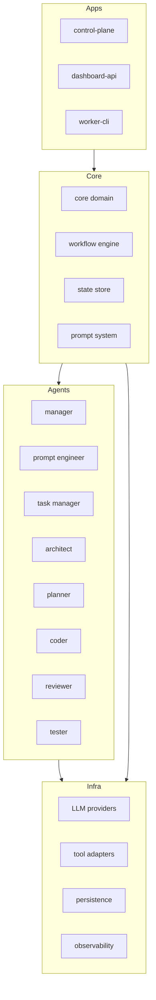
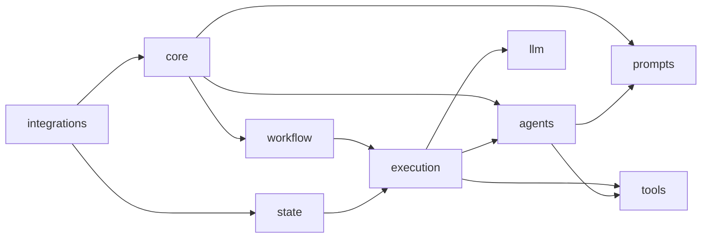
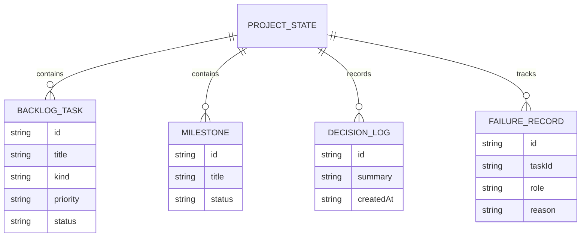
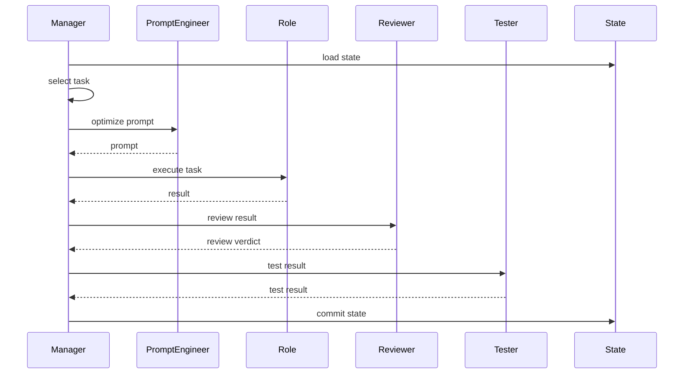
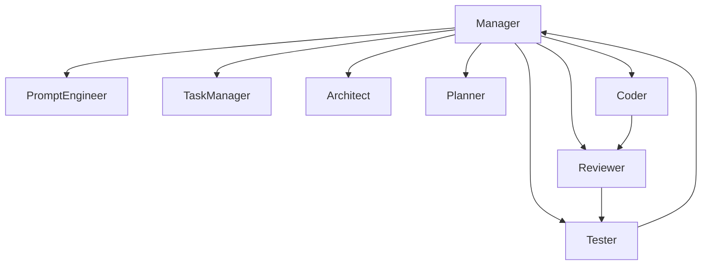
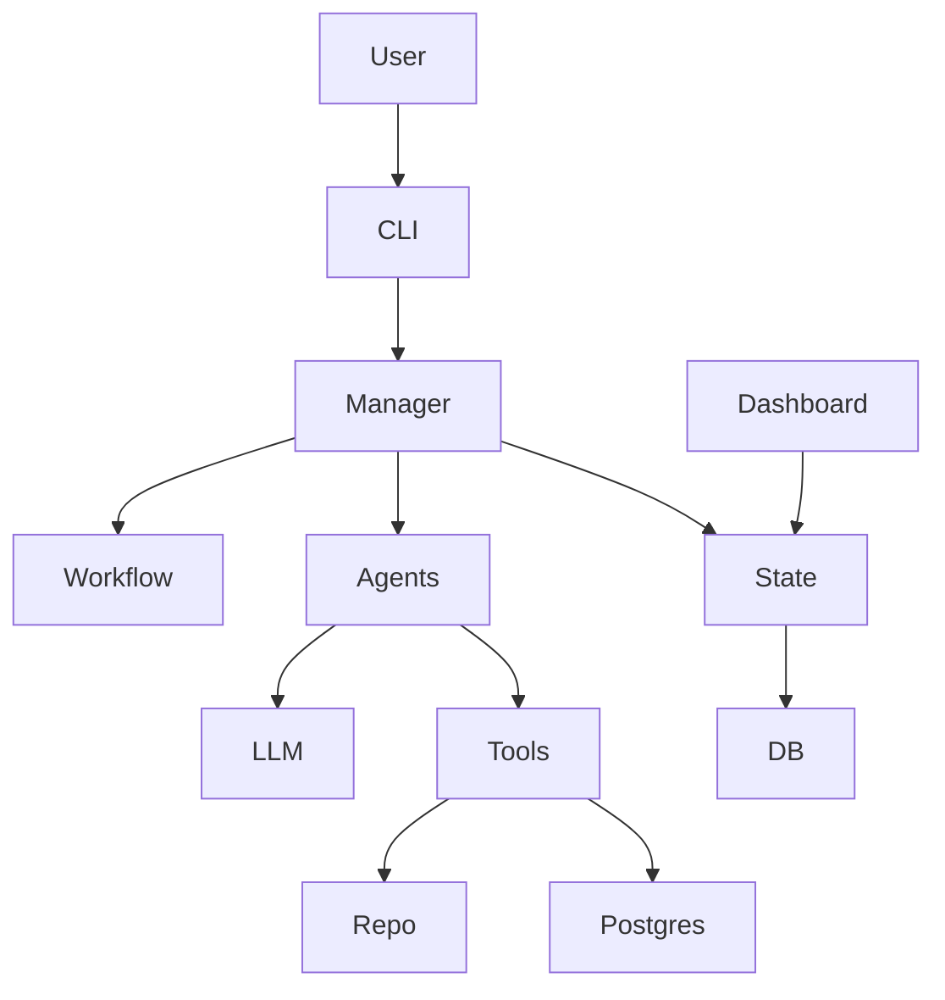

# AI Orchestrator for ts-linq — Technical Specification v2
Version: v2 (Extended Architecture Edition)

This document extends the v1 specification and adds:

- detailed architecture layers
- package dependency map
- database schema
- orchestration sequence diagrams
- API contracts
- CLI contracts
- execution lifecycle
- safety guardrails
- role interaction diagrams

---

# 1. System Architecture (Layered)



---

# 2. Package Dependency Map



Rules:

- core cannot depend on infra
- agents cannot depend on execution
- workflow cannot depend on tools

---

# 3. Database Schema (State Store)

Initial storage uses SQLite.



---

# 4. Execution Lifecycle



---

# 5. CLI Contracts

control-plane CLI commands

```
control-plane bootstrap
control-plane run-cycle
control-plane run-task <task-id>
control-plane run-milestone <milestone-id>
control-plane show-state
control-plane show-backlog
control-plane export-backlog
control-plane export-summary
```

---

# 6. API Contracts (dashboard-api)

Example endpoints

GET /state

Returns:

```
{
  milestone: string,
  activeTask: string,
  repoHealth: string
}
```

GET /backlog

```
{
 tasks: BacklogTask[]
}
```

GET /runs

```
{
 executions: ExecutionSummary[]
}
```

---

# 7. Orchestrator Lifecycle

Orchestrator loop pseudocode

```
while not stopCondition:

 load state

 task = selectTask()

 prompt = promptEngineer.optimize()

 result = role.execute()

 review = reviewer.execute()

 if not review.approved:
     recordFailure()
     continue

 test = tester.execute()

 if not test.passed:
     recordFailure()
     continue

 commitState()
```

---

# 8. Guardrails

Hard rules enforced by Manager:

- coder cannot approve code
- reviewer cannot change code
- tester cannot change code
- architect cannot write code
- tasks cannot skip review if code changed
- tasks cannot skip testing if runtime behavior changed

Safety limits

```
maxRetriesPerTask = 3
maxStepsPerRun = 200
maxTasksPerMilestone = configurable
```

---

# 9. Role Interaction Diagram



---

# 10. Tool Adapter Model

Tools exposed to roles:

FilesystemTool

```
readFile(path)
writeFile(path)
listFiles(path)
```

GitTool

```
status()
diff()
commit()
```

TypeScriptTool

```
check()
diagnostics()
```

PostgresTool

```
runQuery()
explainQuery()
```

---

# 11. Observability

Logs

- cycle_start
- task_selected
- role_execution
- review_result
- test_result
- state_commit

Metrics

- tasks_completed
- retries
- failure_rate
- avg_cycle_time

---

# 12. Security / Safety

Write operations must be scoped.

Allowed write locations

- repo root
- project modules

Forbidden

- system files
- orchestration runtime code itself

---

# 13. Post-MVP Architecture

Add:

- distributed workers
- queue system
- parallel execution
- advanced repo analysis
- automated PR creation
- semantic diffing
- architecture evolution tracking

---

# 14. Implementation Roadmap

Phase 1
core domain + state store

Phase 2
workflow engine

Phase 3
prompt system + role registry

Phase 4
manager + coder + reviewer + tester

Phase 5
bootstrap analyst + architect + planner

Phase 6
tools + repo analysis

Phase 7
dashboard api

Phase 8
integrations

---

# 15. Final Architecture Diagram



---

END OF SPEC
