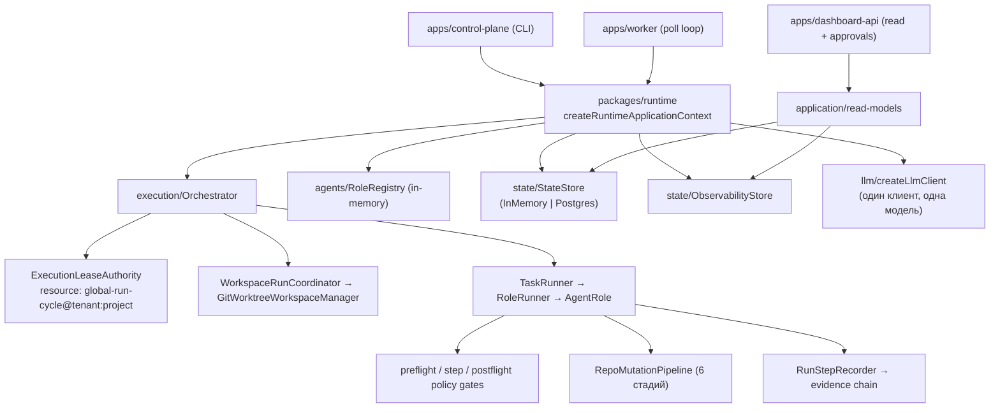
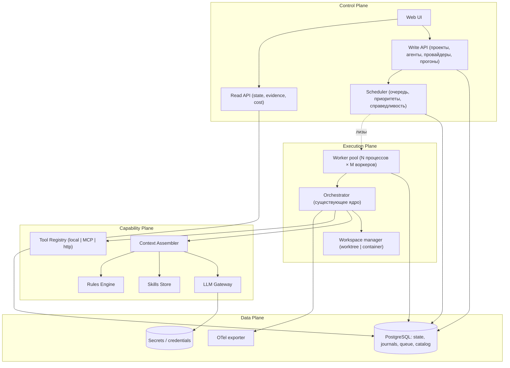

# AI Orchestrator — техническая аналитика и проектирование

> Инженерный документ: анализ текущей реализации, целевая архитектура, контракты, схема данных, план миграции и ADR.
> Продуктовый контекст и приоритеты — в [`next-dev.md`](next-dev.md).
> Разбиение на исполняемые задачи — в [`docs/next-gen/`](docs/next-gen/README.md) (27 групп, 182 таска).
>
> Базовая ревизия: `df87697`. Все ссылки на код проверены по этой ревизии.

---

## 1. Метод и границы анализа

Анализ построен на чтении исходников (`packages/**/src`, `apps/**/src`), схемы миграций, конфигурации и тестов. Утверждения о поведении даны со ссылками на файлы и строки. Валидация репозитория (`pnpm run check`) в рамках этой работы **не запускалась** — документ не делает утверждений о текущем статусе прохождения тестов.

Объём кода:

| Пакет | LOC (src) | Роль |
|---|---:|---|
| `packages/execution` | 6 998 | рантайм прогона, мутации, лизы, восстановление |
| `packages/application` | 3 976 | use-cases, approvals, автономия, SLO |
| `packages/state` | 2 908 | порты и адаптеры персистентности |
| `packages/core` | 2 315 | домен, инварианты, политики |
| `packages/tools` | 1 596 | адаптеры инструментов |
| `packages/agents` | 1 343 | роли |
| `apps/dashboard-api` | 1 174 | read-API |
| `packages/shared` | 1 000 | конфиг, логгер, ошибки |
| `apps/control-plane` | 443 | CLI |
| `packages/llm` | 321 | LLM-клиент |
| `packages/prompts` / `runtime` / `workflow` / `worker` | 323 / 325 / 201 / 186 | промпты, композиция, workflow, воркер |

Тесты: 76 интеграционных файлов в `tests/`, 20 юнит-файлов внутри пакетов, плюс `tests/chaos` и `tests/load`.

---

## 2. Аналитика текущей архитектуры

### 2.1 Фактическая топология



Композиция корректна и уже вынесена из application-слоя (`packages/runtime/src/index.ts`), границы пакетов проверяются скриптом (`scripts/check-package-boundaries.ts`). Это хорошая база: расширение делается добавлением слоёв, а не распутыванием связей.

### 2.2 Сильные стороны (что не трогаем)

1. **Policy-first исполнение.** Ни одно мутирующее действие не проходит мимо гейтов; решения персистятся (`ExecutionPolicyDecision`) и связываются с шагом.
2. **Evidence chain.** `RunStepLogEntry` c `checksum`/`prevChecksum`, `traceId`, `idempotencyKey` — append-only журнал, пригодный для форензики.
3. **Идемпотентность side-effects.** `build-idempotency-key` + dedup-registry с lease-владельцем и TTL защищают push/PR от повторов при ретраях и реплеях.
4. **Лизы с fencing.** `ExecutionLeaseAuthority` + `lease-protected-state-store`: запись в состояние физически невозможна без валидной лизы — редко встречающийся уровень строгости.
5. **Изоляция рабочей копии.** `GitWorktreeWorkspaceManager` с общим на процесс мьютексом на admin-операции git (комментарий в коде прямо фиксирует известный класс повреждений worktree).
6. **Разделение observability и домена.** Метрики/спаны в отдельном сторе, не в снимке состояния.

### 2.3 Ограничения (с доказательствами)

#### A. Однопроектность зашита в порт состояния

```ts
// packages/state/src/StateStore.ts
export interface StateStore {
  load: () => Promise<ProjectState>;               // ← нет скоупа
  save: (state: ProjectState, options?: StateWriteOptions) => Promise<StateMutationResult>;
  // …
}
```

Проект задаётся при создании контекста (`packages/runtime/src/index.ts:57`, дефолт `projectId: 'ai-orchestrator'`). Следствие: **процесс = проект**. Мультипроектность сегодня достигается только запуском N процессов с N конфигами, что несовместимо с общим UI, общим планировщиком и общими бюджетами.

#### B. Монолитный снимок и оптимистическая блокировка

`ProjectState` включает `execution.runStepLog`, `artifacts`, `policyDecisions`, `approvals`, `failures`, `decisions` (`packages/core/src/project-state.ts:92-110`). `save()` пишет весь объект под `expectedRevision`. Отсюда:

- стоимость записи растёт с историей прогона (JSONB-снимок целиком);
- две параллельные задачи одного проекта конфликтуют по ревизии **всегда**, независимо от того, пересекаются ли они логически;
- read-модели вынуждены читать весь снимок ради небольшого среза.

Это соответствует уже зафиксированному issue 004.

#### C. Сериализация прогонов

```ts
// packages/execution/src/orchestrator.ts:155
const executionLease = await this.executionLeaseAuthority.acquireRunLease({
  resource: 'global-run-cycle',
  ownerId: runId,
  scope: { tenantId: state.orgId, projectId: state.projectId },
});
```

Ресурс скоупируется тенантом/проектом (`formatScopedLeaseResource`), то есть проекты не мешают друг другу — но **внутри проекта прогон строго один**. Для «десяти агентов над одним репозиторием» этого недостаточно; при этом сериализовать нужно не «проект», а конкретный конфликтный ресурс (рабочее дерево/базовая ветка/внешнее действие).

#### D. Воркер без очереди

`apps/worker/src/worker-runner.ts` — цикл `runCycle` с экспоненциальным idle/error backoff. Нет: очереди задач, приоритетов, честности между проектами, backpressure. `workflow.workerCount` используется только в валидации конфигурации (`packages/shared/src/config/runtime-config.ts:473-483`) и не влияет на исполнение.

#### E. LLM-слой минимален и частично декоративен

```ts
// packages/llm/src/index.ts
export interface LlmClient {
  generateObject: <TOutput>(request: LlmGenerateRequest<Record<string, unknown>>) => Promise<TOutput>;
}
export type LlmProvider = 'openai' | 'anthropic' | 'mock';
```

- Нет `usage` в ответе → токены считаются эвристикой `estimateObservationTokens` (`packages/execution/src/roles/role-runner.ts:164,180,217`).
- Нет streaming, нативного tool-calling, ретраев, circuit breaker, нескольких одновременных провайдеров.
- **Пер-ролевые модели не работают**: `resolveModelForRole` (`role-runner.ts:224`) влияет только на теги метрик и расчёт стоимости; фактический клиент создан один раз с `config.llm.model` (`packages/runtime/src/index.ts:84-90`). Конфигурация обещает то, чего рантайм не делает.

#### F. Промпт как одна строка, action loop квадратичен

`ProductionCoderRole.generateDecision` собирает единый текстовый промпт и включает в него `JSON.stringify(observations)` целиком на каждом шаге (`packages/agents/src/default-roles.ts:681-697`). При `maxRoleStepsPerTask = N` суммарный объём токенов растёт как O(N²); prompt caching невозможен (нет стабильного префикса сообщений); модель не получает нативного протокола инструментов.

#### G. Закрытые множества ролей и инструментов

```ts
// packages/core/src/roles.ts
export type AgentRoleName = 'bootstrap_analyst' | 'architect' | … | 'docs_writer';
export type ToolCallName = 'file_read' | 'file_write' | … | 'search_repo';
```

Оба union'а — закрытые. Регистрация ролей императивна (`packages/runtime/src/index.ts:119-131`), промпт-шаблоны — константы (`packages/prompts/src/prompt-pipeline.ts:16-29`). Расширение = правка кода + релиз.

#### H. MCP отсутствует

`@modelcontextprotocol/sdk@^1.27.1` объявлен в зависимостях корня; использований в `packages/**` и `apps/**` — ноль. Функциональности нет.

#### I. Конфигурация — процесс-глобальный singleton

`loadRuntimeConfig()` строит один `RuntimeConfig` из `process.env` со строгой схемой и жёсткой валидацией (это хорошо), но выразить «у проекта A политика X, у проекта B политика Y» негде. Секрет один: `LLM_API_KEY`.

#### J. API только на чтение

`apps/dashboard-api` — read-модели + `POST /api/approvals/:id/{approve,reject}`. Создать проект, агента, провайдера или запустить прогон по HTTP нельзя.

### 2.4 Сводная матрица «требование → готовность»

| Требование | Готовность | Что уже помогает | Что отсутствует |
|---|---|---|---|
| Параллельная работа над разными проектами | 15% | Скоуп лизы по проекту, `tenantId/projectId` в evidence/идемпотентности | Скоупированное состояние, реестр проектов, планировщик |
| Параллельные задачи внутри проекта | 5% | Worktree-изоляция, dedup | Ресурсные ключи, инкрементальное состояние, merge queue |
| Несколько LLM-провайдеров | 20% | Абстракция `LlmClient`, конфиг ролевых моделей | Реестр провайдеров, фактический роутинг, fallback |
| Локальные LLM | 0% | — | Ollama/OpenAI-compatible адаптеры, offline-политика |
| CRUD агентов | 5% | `RoleRegistry` как точка расширения | Декларативное определение, хранилище, версии, API |
| MCP | 0% | Нормализованный контракт инструментов | Клиент, реестр, неймспейсы, гейты |
| Skills | 0% | Готовый образец в самом репо (`skills-lock.json`) | Модель данных и загрузчик |
| Rules | 10% | Policy engine умеет проверяемые ограничения | Скоупы, приоритеты, инжекция в контекст |

---

## 3. Целевая архитектура

### 3.1 Разделение на плоскости



Принцип: **ядро исполнения не знает о мультипроектности** — оно получает уже разрешённый контекст прогона (`RunContext`). Всё, что связано с выбором «какой проект, какая задача, какой агент, какая модель», решается выше по стеку.

### 3.2 Изменения по пакетам

| Пакет | Изменение |
|---|---|
| `packages/core` | + `Tenant/Project/Repository`, `AgentDefinition`, `Capability`, `RunContext`; `AgentRoleName` → открытый брендированный `RoleKey` |
| `packages/state` | Скоупированные порты, разделение снимка и журналов, `run_queue`, каталог агентов/провайдеров/capabilities |
| `packages/llm` | Полная замена: gateway, реестр провайдеров, адаптеры, роутинг, usage/cost |
| `packages/agents` | Компилятор `AgentDefinition → AgentRole`, builtin-определения как seed |
| `packages/prompts` | Шаблоны из данных, message-based сборка, бюджет контекста |
| `packages/tools` | Реестр инструментов вместо union, MCP-адаптер |
| `packages/execution` | Ресурсные ключи блокировок, приём `RunContext`, messages-loop |
| `packages/application` | Use-cases CRUD, scheduler-политики, бюджеты |
| `apps/dashboard-api` | + write-контроллеры, SSE-поток прогонов |
| `apps/worker` | Пул воркеров с очередью вместо одиночного poll |
| `apps/control-plane` | Команды над проектами/агентами/провайдерами |
| **новый** `packages/capabilities` | MCP-клиент, skills store, rules engine, context assembler |

---

## 4. Решение 1. Мультипроектное состояние

### 4.1 Доменные сущности

```ts
// packages/core/src/tenancy.ts
export interface Tenant {
  readonly tenantId: string;
  readonly name: string;
  readonly status: 'active' | 'suspended';
  readonly createdAt: string;
}

export interface Project {
  readonly tenantId: string;
  readonly projectId: string;
  readonly name: string;
  readonly repositoryId: string;
  readonly autonomyLevel: AutonomyLevel;          // существующий L0–L5
  readonly configRef: string;                      // версия ProjectConfig
  readonly status: 'active' | 'paused' | 'archived';
  readonly createdAt: string;
}

export interface Repository {
  readonly repositoryId: string;
  readonly tenantId: string;
  readonly provider: 'github' | 'gitlab' | 'bitbucket' | 'local';
  readonly remoteUrl: string;
  readonly defaultBranch: string;
  readonly credentialRef?: string;
  readonly protectedPaths: readonly string[];
  readonly verification: {
    readonly packageManager: 'npm' | 'pnpm';
    readonly commands: readonly VerificationCommand[];   // lint/typecheck/test/build
  };
}
```

### 4.2 Скоупированный порт состояния

Ключевое изменение — все операции принимают скоуп; сам скоуп типизирован уже существующим `TenantScope` (`packages/core/src/multitenancy-tenant-scope.ts`).

```ts
export interface ScopedStateStore {
  load: (scope: TenantScope) => Promise<ProjectState>;
  save: (scope: TenantScope, state: ProjectState, options?: StateWriteOptions) => Promise<StateMutationResult>;
  // журналы — отдельными вызовами, без перезаписи снимка
  appendRunStep: (scope: TenantScope, step: RunStepLogEntry) => Promise<void>;
  appendArtifact: (scope: TenantScope, artifact: ArtifactRecord) => Promise<void>;
  appendPolicyDecision: (scope: TenantScope, decision: ExecutionPolicyDecision) => Promise<void>;
  // …
}
```

**Совместимость.** Существующий `StateStore` сохраняется как тонкий адаптер, связывающий один скоуп:

```ts
export function bindScope(store: ScopedStateStore, scope: TenantScope): StateStore;
```

Это позволяет мигрировать по стратегии strangler: `Orchestrator` и все сервисы продолжают работать со старым портом, пока композиция подставляет им `bindScope(...)`. Ни одна строка `packages/execution` не меняется на этом шаге.

### 4.3 Разделение снимка и журналов

`ProjectState` перестаёт быть контейнером истории. Разделение:

| Осталось в снимке | Уехало в таблицы |
|---|---|
| `revision`, идентификаторы, `summary` | `runStepLog` → `run_step_log` |
| `architecture`, `discovery`, `repoHealth` | `artifacts` → `artifact_log` |
| `backlog`, `milestones` | `policyDecisions` → `policy_decisions` |
| `execution` (активная задача, счётчики, dedup-указатели) | `approvals` → `approval_requests` |
| — | `failures`, `decisions` → соответствующие журналы |

Read-модели получают журналы запросами с фильтрами и пагинацией (частично уже так и работает: `listRunSteps`, `listEvents`).

**Риск и его снятие.** `assertProjectState` и baseline-инварианты завязаны на текущую форму. План: (1) добавить журнальные таблицы и двойную запись под флагом; (2) перевести чтение на журналы; (3) убрать поля из снимка отдельной миграцией; (4) на каждом шаге прогонять `tests/baseline-invariants-regression.test.ts`.

### 4.4 Конфигурация: инстанс + проект

```ts
export interface InstanceConfig {          // из env, как сейчас
  readonly state: StateConfig;
  readonly logging: LoggingConfig;
  readonly queue: QueueConfig;
  readonly security: SecurityConfig;
}

export interface ProjectConfig {           // из БД, версионируется
  readonly projectId: string;
  readonly version: number;
  readonly workflow: WorkflowPolicyConfig;   // лимиты шагов, ретраи, approvals
  readonly tools: ToolPolicyConfig;          // writeMode, protectedPaths, allowedCommands
  readonly budgets: BudgetConfig;            // токены/деньги на прогон/задачу/сутки
  readonly modelRouting: ModelRoutingPolicy;
  readonly agents: readonly AgentAssignment[];
}
```

Разрешение конфигурации: `defaults ← instance ← project ← agent ← run override`, где каждое следующее звено может **только сужать** ограничения безопасности (`writeMode`, `allowedShellCommands`, `approvalRequiredActions`). Эта монотонность проверяется отдельной функцией и юнит-тестом — иначе «настройка агента» превращается в дыру в политике.

```ts
export function narrowToolPolicy(parent: ToolPolicyConfig, child: Partial<ToolPolicyConfig>): ToolPolicyConfig;
// бросает PolicyEscalationError, если child пытается расширить права
```

---

## 5. Решение 2. Планировщик и параллельное исполнение

### 5.1 Очередь работ

Postgres как брокер — новых инфраструктурных зависимостей не появляется, транзакционность с состоянием сохраняется.

```sql
CREATE TABLE run_queue (
  id             UUID PRIMARY KEY,
  tenant_id      TEXT NOT NULL,
  project_id     TEXT NOT NULL,
  task_id        TEXT,
  agent_ref      TEXT NOT NULL,             -- agentId@version
  priority       SMALLINT NOT NULL DEFAULT 100,
  status         TEXT NOT NULL,             -- queued|leased|running|done|failed|dead
  resource_keys  TEXT[] NOT NULL,           -- ресурсы, которые прогон займёт
  available_at   TIMESTAMPTZ NOT NULL,
  lease_owner    TEXT,
  lease_expires  TIMESTAMPTZ,
  attempt        INT NOT NULL DEFAULT 0,
  idempotency_key TEXT NOT NULL,
  payload_json   JSONB NOT NULL,
  created_at     TIMESTAMPTZ NOT NULL
);
CREATE INDEX run_queue_pick_idx ON run_queue (status, available_at, priority);
CREATE UNIQUE INDEX run_queue_idem_idx ON run_queue (tenant_id, project_id, idempotency_key);
```

Забор работы:

```sql
WITH candidate AS (
  SELECT id FROM run_queue
  WHERE status = 'queued' AND available_at <= now()
  ORDER BY priority, available_at
  FOR UPDATE SKIP LOCKED
  LIMIT 1
)
UPDATE run_queue q SET status='leased', lease_owner=$1, lease_expires=now()+$2, attempt=attempt+1
FROM candidate WHERE q.id = candidate.id
RETURNING q.*;
```

Просроченные лизы возвращаются в `queued` фоновым reaper'ом; после `maxAttempts` — `dead` и попадание в существующий dead-letter/replay контур (`packages/execution/src/queue/*`).

### 5.2 Ресурсные ключи вместо глобальной блокировки

```ts
export type ResourceKey =
  | `repo:${string}`                  // административные операции над репо (worktree add/prune)
  | `repo:${string}:branch:${string}` // мутации конкретной базовой ветки
  | `project:${string}:plan`          // изменение backlog/плана
  | `external:${string}`;             // внешний сервис с квотой

export interface ResourceClaim {
  readonly keys: readonly ResourceKey[];
  readonly mode: 'exclusive' | 'shared';
}
```

Правила:

- анализ, планирование, чтение — `shared` на `repo:*`;
- мутация — `exclusive` на `repo:<id>:branch:<base>`;
- git worktree admin — `exclusive` на `repo:<id>` (короткая критическая секция; локально уже защищено мьютексом, теперь и между процессами);
- захват всегда в лексикографическом порядке ключей → отсутствие deadlock'ов.

Захват реализуется через уже существующий `ExecutionLeaseAuthority` (fencing + heartbeat) — меняется только имя ресурса, не механика. Это заменяет `resource: 'global-run-cycle'`.

### 5.3 Планировщик

```ts
export interface SchedulerPolicy {
  readonly maxConcurrentRunsPerInstance: number;
  readonly maxConcurrentRunsPerProject: number;
  readonly maxConcurrentMutationsPerRepository: number;   // как правило 1
  readonly fairness: 'weighted-round-robin';
  readonly projectWeights: Record<string, number>;
}
```

Backpressure: прогон не берётся в работу, если исчерпан дневной бюджет проекта, если превышен лимит активных прогонов, или если проект стоит на паузе. Причина отказа записывается — это закрывает вечный эксплуатационный вопрос «почему ничего не происходит»:

```ts
export type SchedulingBlockReason =
  | 'budget_exhausted' | 'project_paused' | 'resource_busy'
  | 'awaiting_approval' | 'concurrency_limit' | 'no_executable_task';
```

### 5.4 Параллелизм внутри проекта

Условие безопасного параллельного запуска двух задач одного проекта:

1. непересекающиеся `affectedModules` (уже есть в `BacklogTask`) — консервативная проверка по префиксам путей;
2. отсутствие зависимости в графе backlog;
3. каждая задача работает в собственном worktree и собственной ветке;
4. интеграция — через **merge queue**: ветки вливаются последовательно, при конфликте — ребейз и повторная верификация; после `maxRebaseAttempts` задача возвращается в очередь с пометкой конфликта.

### 5.5 Пул воркеров

```ts
export interface WorkerPoolOptions {
  readonly concurrency: number;           // наконец-то реальный workerCount
  readonly leaseTtlMs: number;
  readonly heartbeatIntervalMs: number;
  readonly drainTimeoutMs: number;
}
```

Graceful shutdown: перестать забирать работу → дождаться завершения текущих шагов или отменить их через существующий `propagate-abort` → освободить лизы → выйти. Незавершённые прогоны подхватываются другим воркером через recovery-checkpoints.

---

## 6. Решение 3. LLM Gateway

### 6.1 Контракты

```ts
// packages/llm/src/contracts.ts
export type ProviderKind =
  | 'openai' | 'anthropic' | 'google' | 'azure-openai' | 'bedrock'
  | 'openai-compatible'      // vLLM, LM Studio, llama.cpp server, TGI, OpenRouter, Together, Groq
  | 'ollama'
  | 'mock';

export interface ProviderRegistration {
  readonly providerId: string;
  readonly tenantId: string;
  readonly kind: ProviderKind;
  readonly baseUrl?: string;              // обязателен для локальных/совместимых
  readonly credentialRef?: string;        // ссылка на секрет, не сам секрет
  readonly defaultHeaders?: Readonly<Record<string, string>>;
  readonly egressClass: 'public' | 'private';   // private = локальная сеть
  readonly enabled: boolean;
}

export interface ModelDescriptor {
  readonly modelId: string;               // "qwen2.5-coder:32b"
  readonly providerId: string;
  readonly contextWindow: number;
  readonly maxOutputTokens: number;
  readonly capabilities: ModelCapabilities;
  readonly cost: { readonly inputPer1kUsdMicro: number; readonly outputPer1kUsdMicro: number };
}

export interface ModelCapabilities {
  readonly structuredOutput: 'native_schema' | 'tool_call' | 'grammar' | 'json_mode' | 'none';
  readonly toolCalling: boolean;
  readonly streaming: boolean;
  readonly vision: boolean;
  readonly promptCaching: boolean;
}
```

Единый запрос — **сообщения, а не строка**:

```ts
export interface ChatMessage {
  readonly role: 'system' | 'user' | 'assistant' | 'tool';
  readonly content: readonly ContentPart[];
  readonly toolCallId?: string;
  readonly cacheHint?: 'stable_prefix';        // для prompt caching
}

export interface ChatRequest {
  readonly messages: readonly ChatMessage[];
  readonly tools?: readonly ToolSpec[];
  readonly responseSchema?: { readonly name: string; readonly schema: Record<string, unknown> };
  readonly temperature?: number;
  readonly maxOutputTokens?: number;
  readonly timeoutMs: number;
  readonly signal?: AbortSignal;
}

export interface ChatResponse<TOutput = unknown> {
  readonly modelId: string;
  readonly providerId: string;
  readonly text?: string;
  readonly parsed?: TOutput;                    // если запрошена схема
  readonly toolCalls: readonly ToolCall[];
  readonly usage: TokenUsage;
  readonly finishReason: 'stop' | 'length' | 'tool_calls' | 'content_filter' | 'error';
  readonly latencyMs: number;
}

export interface TokenUsage {
  readonly inputTokens: number;
  readonly outputTokens: number;
  readonly cachedInputTokens?: number;
  readonly estimated: boolean;                  // true, если провайдер не вернул usage
}

export interface ModelProviderAdapter {
  readonly kind: ProviderKind;
  listModels: (registration: ProviderRegistration) => Promise<readonly ModelDescriptor[]>;
  chat: <TOutput>(registration: ProviderRegistration, model: ModelDescriptor, request: ChatRequest) => Promise<ChatResponse<TOutput>>;
  health: (registration: ProviderRegistration) => Promise<ProviderHealth>;
}
```

### 6.2 Локальные модели

| Стек | Адаптер | Особенности |
|---|---|---|
| **Ollama** | нативный | `/api/chat`, дискавери через `/api/tags`, structured output через `format` (JSON Schema), tool calling у поддерживающих моделей, `keep_alive` для прогрева |
| **vLLM** | `openai-compatible` | `/v1/chat/completions`, `guided_json` / `response_format`, высокая пропускная способность |
| **LM Studio** | `openai-compatible` | локальный сервер `/v1`, без ключа |
| **llama.cpp server** | `openai-compatible` | поддержка GBNF-грамматик → стратегия `grammar` для строгого JSON |
| **TGI / Ray Serve / любой gateway** | `openai-compatible` | конфигурируется `baseUrl` |

Практические следствия, которые надо заложить сразу:

1. **Structured output деградирует**. Стратегия по убыванию: `native_schema` → `tool_call` (схема как единственный инструмент) → `grammar` → `json_mode` + repair-проход. Ошибка валидации → один repair-запрос с текстом ошибки; повторная неудача → нормализованная `SchemaValidationError` (контракт уже существует).
2. **Контекст меньше**. Сборщик контекста обязан знать `contextWindow` и урезать по бюджету, иначе локальные модели будут молча терять хвост.
3. **Нет usage у части серверов** → `estimated: true`, считаем токенизатором-приближением, помечаем в метриках отдельным тегом.
4. **Прогрев и параллелизм**. Локальный хост — ресурс с ограниченной конкурентностью; вводим `maxConcurrentRequests` на провайдера и очередь запросов, иначе воркеры выстроятся в неуправляемую очередь на GPU.

### 6.3 Маршрутизация и устойчивость

```ts
export interface ModelRoutingRule {
  readonly when: {
    readonly agentId?: string;
    readonly roleKey?: string;
    readonly stage?: 'plan' | 'implement' | 'review' | 'test' | 'docs';
    readonly complexity?: 'low' | 'medium' | 'high';
  };
  readonly candidates: readonly string[];        // ["local/qwen-coder", "anthropic/…"]
  readonly constraints?: {
    readonly egressClass?: 'private';            // «только локально»
    readonly minContextWindow?: number;
    readonly requiresToolCalling?: boolean;
    readonly maxCostPer1kUsdMicro?: number;
  };
}
```

Алгоритм: отфильтровать кандидатов по ограничениям и здоровью провайдера → взять первого → при ошибке класса `retriable` повторить с джиттером (лимит по политике) → при исчерпании перейти к следующему кандидату, зафиксировав `model_fallback_total` в метриках → если кандидаты кончились, вернуть `LlmProviderError` (контракт сохраняется).

Circuit breaker на провайдера: N ошибок за окно → `open` на cooldown, запросы сразу уходят следующему кандидату; `half-open` пробник.

Классификация ошибок обязательна и нормализуется на уровне gateway:

```ts
export type LlmErrorKind =
  | 'auth' | 'rate_limit' | 'context_overflow' | 'content_filter'
  | 'timeout' | 'cancelled' | 'server' | 'network' | 'schema' | 'unsupported';
```

`rate_limit` и `server` — retriable; `auth`, `content_filter`, `unsupported` — нет. Сейчас всё сводится к одному `LlmProviderError`, из-за чего ретрай-политика не может принимать осмысленных решений.

### 6.4 Учёт стоимости

`usage` из ответа → `run_cost` запись с разбивкой `(runId, taskId, agentRef, providerId, modelId, inputTokens, outputTokens, cachedTokens, costUsdMicro, estimated)`. Существующий `RoleRunCostTracker` перестаёт оценивать и начинает агрегировать факты; бюджеты (`tokenBudgetPerRun`, `maxRunCostUsdMicro`) остаются, но становятся точными. Кэшированные входные токены учитываются по своей цене — иначе экономия от prompt caching не будет видна.

### 6.5 Секреты

```ts
export interface CredentialStore {
  put: (ref: string, value: string, scope: TenantScope) => Promise<void>;
  get: (ref: string, scope: TenantScope) => Promise<string>;      // только в момент запроса
  rotate: (ref: string, value: string, scope: TenantScope) => Promise<void>;
}
```

Реализация по умолчанию — таблица с шифрованием AES-GCM на ключе из env/KMS. Значение никогда не попадает в `ProviderRegistration`, в логи и в состояние; существующий механизм `registerRuntimeSecrets` + `redactSecrets` (`packages/shared/src/config/runtime-config.ts`) распространяется на креды провайдеров.

---

## 7. Решение 4. Агенты как данные

### 7.1 Определение агента

```ts
export interface AgentDefinition {
  readonly agentId: string;
  readonly version: number;                       // иммутабельна после публикации
  readonly tenantId: string;
  readonly name: string;
  readonly description: string;
  readonly roleKey: RoleKey;                      // 'coder' | 'reviewer' | пользовательский
  readonly kind: 'builtin' | 'custom';
  readonly status: 'draft' | 'published' | 'deprecated';

  readonly instructions: {
    readonly system: string;                      // шаблон с плейсхолдерами
    readonly objectiveTemplate: string;
    readonly acceptanceCriteria: readonly string[];
  };

  readonly output: {
    readonly schemaName: string;
    readonly jsonSchema: Record<string, unknown>; // регистрируется в role-output-schema-registry
  };

  readonly capabilities: {
    readonly tools: readonly ToolBinding[];       // локальные + mcp:*
    readonly mcpServers: readonly string[];
    readonly skills: readonly string[];
    readonly rules: readonly string[];
  };

  readonly model: {
    readonly routingRuleId?: string;
    readonly preferred?: readonly string[];
    readonly temperature?: number;
    readonly maxOutputTokens?: number;
  };

  readonly limits: {
    readonly maxSteps: number;
    readonly maxWallTimeMs: number;
    readonly tokenBudget?: number;
    readonly costBudgetUsdMicro?: number;
  };

  readonly policy: {
    readonly writeMode: SafeWriteMode;            // только сужение проектной политики
    readonly approvalRequiredActions: readonly ApprovalRequestedAction[];
    readonly autonomyCeiling: AutonomyLevel;
  };

  readonly createdAt: string;
  readonly createdBy: string;
}
```

Формат хранения — JSON в БД; экспорт/импорт — YAML для читаемости в git.

### 7.2 Открытие закрытого union'а

```ts
// было: export type AgentRoleName = 'coder' | …
export type RoleKey = string & { readonly __brand: 'RoleKey' };

export const BUILTIN_ROLE_KEYS = [
  'bootstrap_analyst', 'architect', 'planner', 'release_auditor', 'state_steward',
  'integration_manager', 'task_manager', 'prompt_engineer', 'coder', 'reviewer',
  'tester', 'docs_writer',
] as const;
export type BuiltinRoleKey = (typeof BUILTIN_ROLE_KEYS)[number];
```

Ключевой инженерный момент: сегодня `AgentRoleName` используется как ключ в `Record<AgentRoleName, …>` (например, шаблоны промптов) — при открытии union'а такие места должны стать `Map`/`Record<string, …>` с явной обработкой отсутствия и понятной ошибкой. Это механическая, но широкая правка; делать её отдельным коммитом без изменения поведения, под существующие тесты ролей.

### 7.3 Компиляция определения в исполняемую роль

```ts
export interface AgentCompiler {
  compile: (definition: AgentDefinition, deps: {
    readonly gateway: LlmGateway;
    readonly toolRegistry: ToolRegistry;
    readonly contextAssembler: ContextAssembler;
  }) => AgentRole<AgentInput, unknown>;
}
```

Скомпилированная роль — это **обобщённая реализация action-loop** (одна на все декларативные агенты), а не кодогенерация:

1. собрать контекст (state summary + rules + skills + наблюдения) с бюджетом токенов;
2. позвать модель через gateway с `tools` из привязок и `responseSchema` из определения;
3. на `tool_calls` — исполнить через `ToolRegistry` под гейтами и записать наблюдение как сообщение роли `tool`;
4. на финальный ответ — провалидировать по `jsonSchema` и вернуть `RoleResponse`.

Существующие 12 ролей поставляются как seed-определения и продолжают работать через свои TS-классы до тех пор, пока паритет с декларативной реализацией не подтверждён тестами (`tests/*-role.test.ts` — это ворота).

### 7.4 Жизненный цикл и безопасность

```
draft ──validate──► validated ──publish──► published ──deprecate──► deprecated
  ▲                                  │
  └──────────── edit (новая версия) ─┘
```

Валидация при публикации:

1. zod-схема определения;
2. ссылочная целостность: существуют ли указанные skills, MCP-серверы, правила, модели;
3. **проверка неэскалации**: `narrowToolPolicy(projectPolicy, agentPolicy)` не бросает;
4. компиляция JSON-схемы вывода и регистрация в `role-output-schema-registry`;
5. dry-run на фикстурном репозитории (`tests/support/scratch-git-repo.ts` уже даёт механику) с mock- или дешёвой моделью.

В evidence каждого шага пишется `agentRef = agentId@version` — воспроизводимость прогонов сохраняется при любых последующих правках агента.

---

## 8. Решение 5. Capability Plane

### 8.1 Реестр инструментов

```ts
export interface ToolDescriptor {
  readonly toolName: string;                    // 'file_write' | 'mcp:github:create_issue'
  readonly source: 'local' | 'mcp' | 'http';
  readonly inputSchema: Record<string, unknown>;
  readonly outputSchema?: Record<string, unknown>;
  readonly determinism: ToolDeterminismMetadata; // контракт уже существует
  readonly riskClass: 'read' | 'write_workspace' | 'write_external' | 'destructive';
  readonly requiresApproval: boolean;
  readonly timeoutMs: number;
}

export interface ToolRegistry {
  list: (scope: TenantScope, bindings: readonly ToolBinding[]) => readonly ToolDescriptor[];
  execute: (request: UnifiedToolRequest, options: ToolExecutionOptions) => Promise<UnifiedToolResult>;
}
```

`UnifiedToolRequest/Result` и нормализация ошибок уже реализованы (`packages/tools/src/contracts.ts`, `errors/tool-error-envelope.ts`) — MCP встраивается в существующий контракт, а не рядом с ним. Это принципиально: **все** инструменты, включая внешние, проходят один и тот же путь гейтов, dedup и evidence.

### 8.2 MCP

```ts
export interface McpServerRegistration {
  readonly serverId: string;
  readonly tenantId: string;
  readonly scope: 'instance' | 'project';
  readonly transport:
    | { readonly kind: 'stdio'; readonly command: string; readonly args: readonly string[]; readonly env?: Readonly<Record<string, string>> }
    | { readonly kind: 'http'; readonly url: string; readonly headers?: Readonly<Record<string, string>> };
  readonly credentialRefs: readonly string[];
  readonly allowedTools?: readonly string[];      // allow-list; пусто = все обнаруженные
  readonly riskOverrides?: Readonly<Record<string, ToolDescriptor['riskClass']>>;
  readonly enabled: boolean;
}
```

Правила интеграции:

1. **Неймспейс.** Инструмент виден агенту как `mcp:<serverId>:<toolName>` — коллизий с локальными именами нет.
2. **Классификация риска обязательна.** Инструмент неизвестного риска считается `write_external` и требует approval, пока оператор не понизит класс явно. Безопасный дефолт важнее удобства.
3. **Изоляция.** `stdio`-серверы запускаются как дочерние процессы с ограниченным окружением (переменные — только из `credentialRefs`), таймаутом, лимитом вывода и обязательным убийством дерева процессов при отмене (`propagate-abort` уже есть).
4. **Вывод MCP — данные.** Результат никогда не интерпретируется как инструкция; в контекст попадает в блоке с явной пометкой источника. Это основная защита от prompt injection через внешние сервисы.
5. **Health и деградация.** Недоступный сервер → инструменты исключаются из списка агента, прогон продолжается с явным предупреждением, а не падает.
6. **Пул подключений.** Один процесс сервера на (tenant, serverId), с ленивым стартом и idle-таймаутом; переиспользование между прогонами.

### 8.3 Skills

Модель повторяет то, что уже работает в этом репозитории (`.agents/skills/*`, `skills-lock.json`):

```ts
export interface SkillDefinition {
  readonly skillId: string;
  readonly name: string;
  readonly description: string;                 // ← только это попадает в контекст по умолчанию
  readonly triggers: readonly string[];          // ключевые слова/паттерны для релевантности
  readonly body: string;                         // подгружается по требованию
  readonly resources: readonly SkillResource[];  // файлы, шаблоны, скрипты
  readonly source: { readonly kind: 'inline' | 'git' | 'registry'; readonly ref?: string; readonly checksum: string };
  readonly version: string;
}
```

**Прогрессивное раскрытие** — обязательное свойство: в системный промпт попадает каталог `name + description`; тело загружается, когда агент явно запрашивает скилл инструментом `skill_load`. Иначе десяток скиллов съест контекст локальной модели целиком.

Целостность: lock-файл с `checksum`, проверка при загрузке, отказ при несовпадении — защита от подмены внешнего источника.

### 8.4 Rules

```ts
export interface Rule {
  readonly ruleId: string;
  readonly scope: { readonly level: 'org' | 'project' | 'agent' | 'path'; readonly selector?: string };
  readonly priority: number;
  readonly kind: 'guidance' | 'enforced';
  readonly text: string;                        // для guidance — в промпт
  readonly predicate?: RulePredicate;            // для enforced — в policy engine
  readonly severity: 'info' | 'warn' | 'block';
}

export type RulePredicate =
  | { readonly type: 'forbid_path_write'; readonly globs: readonly string[] }
  | { readonly type: 'require_approval_for'; readonly actions: readonly ApprovalRequestedAction[] }
  | { readonly type: 'max_changed_files'; readonly value: number }
  | { readonly type: 'require_tests_for_paths'; readonly globs: readonly string[] }
  | { readonly type: 'forbid_tool'; readonly tools: readonly string[] }
  | { readonly type: 'forbid_dependency_add' };
```

Два класса — сознательное решение: **guidance** влияет на модель, **enforced** исполняется детерминированно в `ExecutionPolicyEngine` и не зависит от того, «послушалась» ли модель. Правило, которое можно проверить, должно быть `enforced`; `guidance` — для стилевых и архитектурных предпочтений.

Разрешение конфликтов: сортировка по `(level: path > agent > project > org, priority)`; при равенстве побеждает более строгое. Итоговый набор правил прогона фиксируется в evidence — «почему агент так поступил» становится восстановимым.

### 8.5 Сборка контекста

```ts
export interface ContextAssembler {
  assemble: (input: {
    readonly agent: AgentDefinition;
    readonly runContext: RunContext;
    readonly stateSummary: string;
    readonly observations: readonly RoleObservation[];
    readonly budget: { readonly maxInputTokens: number };
    readonly model: ModelDescriptor;
  }) => Promise<readonly ChatMessage[]>;
}
```

Порядок и приоритет вытеснения (вытесняем снизу вверх):

1. системные инструкции агента + enforced-правила (никогда не вытесняются);
2. описание задачи и критерии приёмки;
3. guidance-правила по релевантности;
4. каталог скиллов (описания);
5. сводка состояния проекта;
6. последние N наблюдений полностью;
7. более ранние наблюдения — в сжатом виде (краткое резюме результата инструмента, а не полный вывод);
8. долговременная память проекта — по релевантности.

Пункты 1–2 маркируются `cacheHint: 'stable_prefix'` — при поддержке провайдером это даёт основную экономию в длинных action-loop'ах. Сжатие наблюдений (п. 7) — прямое лекарство от текущего квадратичного роста промпта.

---

## 9. Решение 6. Action loop на сообщениях

Текущий цикл (`RoleRunner.executeRoleWithLoop`) сохраняется как каркас — меняется способ общения с моделью:

| Было | Станет |
|---|---|
| Один строковый промпт, наблюдения через `JSON.stringify` | Список сообщений; результат инструмента — сообщение роли `tool` |
| Инструмент через самодельную JSON-схему `request_tool` | Нативный tool-calling там, где поддерживается; эмуляция — фолбэк |
| Токены оцениваются | Токены из `usage` |
| Нет кэширования | Стабильный префикс + `cacheHint` |
| Рост O(N²) | Рост O(N) при сжатии старых наблюдений |

Инварианты, которые обязаны сохраниться (тесты уже есть): лимит шагов, wall-time бюджет, отмена по `AbortSignal`, валидация выходной схемы с одним повтором, запись каждого шага в evidence, проверка лизы перед записью в состояние.

---

## 10. Решение 7. Изоляция исполнения

Два режима workspace-менеджера (интерфейс `WorkspaceManager` уже существует и расширяем):

| Режим | Когда | Свойства |
|---|---|---|
| `git-worktree` (есть) | Доверенный код, локальная разработка | Быстро, дёшево; изоляция только по файловой системе |
| `container` (новый) | Недоверенный код, публичные репозитории, жёсткие требования | Docker/OCI: лимиты CPU/RAM, сеть по allow-list, монтирование только рабочего дерева, отдельный пользователь |

Контейнерный режим также решает проблему «инструмент `shell_exec` в общем процессе»: команды исполняются внутри контейнера, а не на хосте. Существующая политика (`allowedShellCommands`, `writeMode`, `protectedWritePaths`) остаётся первым рубежом, контейнер — вторым.

Сетевая политика прогона:

```ts
export interface EgressPolicy {
  readonly mode: 'deny_all' | 'allow_list' | 'unrestricted';
  readonly allowedHosts: readonly string[];       // провайдеры моделей, git-хост, реестры пакетов
}
```

Профиль `offline` = `deny_all` + провайдеры только с `egressClass: 'private'`. Это и есть техническая гарантия «код не покидает периметр», которую нельзя обеспечить одними лишь настройками модели.

---

## 11. Решение 8. API и поверхность управления

### 11.1 HTTP

```
# Каталог
POST   /api/v1/projects                     создать проект
GET    /api/v1/projects
GET    /api/v1/projects/{id}
PATCH  /api/v1/projects/{id}                пауза/возобновление/конфиг
POST   /api/v1/repositories                 подключить репозиторий

# Модели
POST   /api/v1/providers                    зарегистрировать провайдера (в т.ч. локального)
POST   /api/v1/providers/{id}/test          health + список моделей
GET    /api/v1/models                       агрегированный каталог моделей

# Агенты
POST   /api/v1/agents                       создать (draft)
PUT    /api/v1/agents/{id}                  изменить draft
POST   /api/v1/agents/{id}/publish          валидация + публикация версии
POST   /api/v1/agents/{id}/dry-run          прогон на фикстуре
DELETE /api/v1/agents/{id}                  deprecate (мягкое удаление)

# Capabilities
POST   /api/v1/mcp-servers
POST   /api/v1/skills
POST   /api/v1/rules

# Исполнение
POST   /api/v1/projects/{id}/runs           поставить прогон в очередь
GET    /api/v1/runs/{runId}                 статус + шаги
GET    /api/v1/runs/{runId}/events          SSE-поток
POST   /api/v1/runs/{runId}/cancel
POST   /api/v1/runs/{runId}/interject       подсказка/коррекция в середине
GET    /api/v1/approvals                    inbox
POST   /api/v1/approvals/{id}/approve|reject  (уже есть)
```

Все мутирующие вызовы: идемпотентны по заголовку `Idempotency-Key` (механика в домене уже есть), проходят RBAC/ABAC (`apps/control-plane/src/authz/rbac-abac.ts` переиспользуется как общий модуль), пишутся в immutable audit log.

### 11.2 CLI

CLI остаётся первоклассным интерфейсом (важно для CI): те же операции, что и в API, плюс локальные режимы отладки. Существующие команды сохраняются, добавляется обязательный `--project`.

### 11.3 События

Единая шина событий прогона (`run.step.started`, `run.step.finished`, `run.approval.requested`, `run.finished`, `cost.threshold.reached`) → SSE для UI, webhooks для интеграций, Slack/Telegram для уведомлений.

---

## 12. Схема данных и миграции

Текущая версия схемы: `POSTGRES_REQUIRED_SCHEMA_VERSION = 8` (`packages/state/src/postgres/migrations.ts`). План продолжения — строго аддитивный, с явным контрактом миграции (механика `PostgresMigrationRunner` с чек-суммами уже есть).

| Версия | Содержание | Фаза |
|---|---|---|
| v9 | `tenants`, `projects`, `repositories`, `project_configs` | P0 |
| v10 | Скоуп `(tenant_id, project_id)` во всех журнальных таблицах + индексы; бэкофилл существующих строк константами из текущего снимка | P0 |
| v11 | `providers`, `models`, `credentials`, `run_cost` | P0 |
| v12 | `run_queue`, `resource_leases` (расширение существующих локов) | P1 |
| v13 | `agent_definitions`, `agent_versions`, `agent_assignments` | P2 |
| v14 | `mcp_servers`, `skills`, `rules`, `capability_bindings` | P2 |
| v15 | Вынос `run_step_log`/`artifacts`/`policy_decisions` из снимка (удаление полей) | P2 |

Правила миграций: только аддитивные шаги в пределах релиза; удаление полей — отдельной версией после того, как читатели переведены; каждая версия сопровождается обновлением ранбука (`docs/runbooks/postgres-state-migrations.md`).

Пример ключевых таблиц:

```sql
CREATE TABLE projects (
  tenant_id      TEXT NOT NULL,
  project_id     TEXT NOT NULL,
  name           TEXT NOT NULL,
  repository_id  UUID NOT NULL REFERENCES repositories(id),
  autonomy_level SMALLINT NOT NULL,
  status         TEXT NOT NULL,
  config_version INT NOT NULL,
  created_at     TIMESTAMPTZ NOT NULL,
  PRIMARY KEY (tenant_id, project_id)
);

CREATE TABLE agent_versions (
  agent_id     UUID NOT NULL,
  version      INT NOT NULL,
  tenant_id    TEXT NOT NULL,
  status       TEXT NOT NULL,
  definition   JSONB NOT NULL,
  checksum     TEXT NOT NULL,
  created_at   TIMESTAMPTZ NOT NULL,
  created_by   TEXT NOT NULL,
  PRIMARY KEY (agent_id, version)
);

CREATE TABLE run_cost (
  id            UUID PRIMARY KEY,
  tenant_id     TEXT NOT NULL,
  project_id    TEXT NOT NULL,
  run_id        UUID NOT NULL,
  task_id       TEXT,
  agent_ref     TEXT NOT NULL,
  provider_id   TEXT NOT NULL,
  model_id      TEXT NOT NULL,
  input_tokens  INT NOT NULL,
  output_tokens INT NOT NULL,
  cached_tokens INT NOT NULL DEFAULT 0,
  cost_usd_micro BIGINT NOT NULL,
  estimated     BOOLEAN NOT NULL,
  created_at    TIMESTAMPTZ NOT NULL
);
CREATE INDEX run_cost_run_idx ON run_cost (run_id);
CREATE INDEX run_cost_project_day_idx ON run_cost (tenant_id, project_id, created_at DESC);
```

---

## 13. Стратегия миграции кода

Принцип — **strangler с сохранением портов**. Каждая фаза даёт работающую систему.

**Шаг 1. Скоуп без изменения ядра.** Вводим `ScopedStateStore` и `bindScope`. `Orchestrator` продолжает получать `StateStore`. Риск минимален, покрытие существующими тестами полное.

**Шаг 2. Журналы наружу.** Двойная запись (снимок + таблица) под флагом `STATE_JOURNALS_MODE=dual|table`. Читатели переводятся по одному. Затем — удаление полей из снимка (v15).

**Шаг 3. LLM Gateway за старым интерфейсом.** Новый пакет реализует `LlmClient.generateObject` как тонкую обёртку над `chat()` — существующие роли не меняются. Затем роли постепенно переводятся на `chat()` с сообщениями и tool-calling.

**Шаг 4. Ресурсные ключи.** Заменяем `'global-run-cycle'` на вычисляемый claim. Для однопроектного режима поведение идентично (один ключ — та же сериализация), поэтому шаг безопасен и обратим.

**Шаг 5. Очередь.** Воркер сначала умеет оба режима: `poll` (как сейчас) и `queue`. Переключение — конфигурацией.

**Шаг 6. Открытие union'ов.** `AgentRoleName → RoleKey`, `ToolCallName → string` + реестр. Механическая правка, отдельным коммитом, без изменения поведения.

**Шаг 7. Декларативные агенты.** Обобщённая роль + seed-определения. Builtin-классы остаются, пока паритет не подтверждён.

Ворота на каждом шаге: `pnpm run check` (границы пакетов, lint, typecheck, тесты) + `tests/baseline-invariants-regression.test.ts` + chaos/load-профили.

---

## 14. ADR: ключевые решения и альтернативы

| # | Решение | Альтернативы | Почему так |
|---|---|---|---|
| ADR-1 | Скоуп `(tenantId, projectId)` во всех портах состояния | Отдельная БД/схема на проект | Единый UI, планировщик и бюджеты требуют общего хранилища; схема на проект множит миграции и операционную нагрузку |
| ADR-2 | Журналы отдельно от снимка | Оставить монолитный снимок | Снимок растёт с историей, конкурентные записи конфликтуют по ревизии; issue 004 |
| ADR-3 | Очередь в PostgreSQL (`SKIP LOCKED`) | Redis Streams, RabbitMQ, Temporal | Нет новой инфраструктуры; транзакционность с состоянием; уже есть Postgres-лизы и dead-letter. Temporal — избыточен и дублирует существующий движок восстановления |
| ADR-4 | Ресурсные ключи вместо глобальной блокировки | Оставить сериализацию на проект | Сериализовать нужно конфликтующий ресурс, а не проект; иначе параллелизм внутри проекта невозможен в принципе |
| ADR-5 | Собственный LLM gateway | Vercel AI SDK, LangChain, LiteLLM | Нужны учёт стоимости, гейты, evidence и политика egress, интегрированные с доменом; сторонний слой пришлось бы всё равно оборачивать. Точечное переиспользование клиентских SDK допустимо |
| ADR-6 | Один `openai-compatible` адаптер на все локальные стеки | Отдельный адаптер на каждый | vLLM/LM Studio/llama.cpp/TGI/OpenRouter говорят на одном протоколе; различия выражаются capability-матрицей, а не кодом |
| ADR-7 | Ollama — нативный адаптер | Через openai-compatible | Нужны дискавери моделей (`/api/tags`), `keep_alive`, специфика `format` — заметно лучше UX для главного локального сценария |
| ADR-8 | Три стратегии structured output с деградацией | Требовать native JSON schema | Локальные модели часто не поддерживают native; без деградации локальный сценарий нерабочий |
| ADR-9 | Агент — данные, исполняются обобщённым action-loop | Кодогенерация TS-класса из определения | Кодогенерация требует сборки и релиза, ломает динамический CRUD и усложняет аудит |
| ADR-10 | Права агента = пересечение с проектной политикой | Агент задаёт свои права | Иначе создание агента становится каналом эскалации привилегий |
| ADR-11 | MCP-инструменты проходят те же гейты, что локальные | Отдельный упрощённый путь | Единый путь = единый аудит; внешние инструменты рискованнее локальных, а не наоборот |
| ADR-12 | Skills с прогрессивным раскрытием | Складывать всё в системный промпт | Контекст локальных моделей мал; полное раскрытие делает скиллы бесполезными |
| ADR-13 | Rules разделены на guidance и enforced | Только текстовые правила | Текстовое правило — не гарантия; проверяемые ограничения должны исполняться детерминированно |
| ADR-14 | Секреты в шифрованном хранилище со ссылками | Env-переменные | Мультиарендность и ротация несовместимы с process-global env |
| ADR-15 | Контейнерная песочница как второй режим, не замена worktree | Всегда контейнер | Контейнеры дороже и медленнее; для доверенного кода избыточны |

---

## 15. Тестовая стратегия для новых слоёв

| Слой | Тип | Что проверяем |
|---|---|---|
| Скоупированное состояние | Интеграционный | Изоляция двух проектов; конкурентные записи; корректность `expectedRevision` |
| Очередь | Интеграционный + chaos | `SKIP LOCKED` без дублей; возврат просроченной лизы; dead-letter после N попыток |
| Ресурсные ключи | Property-based | Отсутствие deadlock при произвольном порядке заявок; взаимоисключение mutation-ключей |
| LLM Gateway | Юнит + контрактные | Каждый адаптер против записанных ответов (cassettes); классификация ошибок; fallback-цепочка; корректность usage/cost |
| Локальные провайдеры | Опциональный e2e | Прогон против поднятого Ollama, помечен как `optional` и пропускается без хоста |
| Structured output | Матричный | Для каждой стратегии: валидная схема, невалидный ответ + repair, неисправимый ответ |
| Агенты | Интеграционный | Паритет builtin-класса и декларативной версии на одинаковых входах |
| Валидация агента | Юнит | Попытка эскалации прав отклоняется; битые ссылки на capabilities отклоняются |
| MCP | Интеграционный | Фикстурный MCP-сервер: обнаружение, вызов, таймаут, падение сервера, отмена |
| Rules | Юнит | Приоритеты и разрешение конфликтов; enforced-предикаты блокируют мутацию |
| Context assembler | Юнит | Соблюдение бюджета токенов; порядок вытеснения; неудаляемость системных блоков |
| Параллелизм | Load | 20 одновременных прогонов, 5 проектов: инвариантов не нарушено, дублей side-effect нет |

Отдельно: **LLM-кассеты** (запись/воспроизведение ответов) делают e2e детерминированными и дешёвыми — без них тесты новых слоёв будут либо флаки, либо дорогими.

---

## 16. Наблюдаемость новых компонентов

Добавляемые метрики (в существующий `ObservabilityStore`, затем экспорт в OTel):

| Метрика | Тип | Теги |
|---|---|---|
| `llm_request_total` | counter | provider, model, agent, outcome |
| `llm_tokens_total` | counter | provider, model, direction(input/output/cached), estimated |
| `llm_cost_usd_micro_total` | counter | provider, model, project, agent |
| `llm_fallback_total` | counter | from_model, to_model, reason |
| `llm_circuit_state` | gauge | provider, state |
| `queue_depth` | gauge | project, priority |
| `queue_wait_seconds` | histogram | project |
| `run_concurrency` | gauge | instance, project |
| `resource_lock_wait_seconds` | histogram | resource_key |
| `mcp_tool_call_total` | counter | server, tool, outcome |
| `context_tokens_used` | histogram | agent, model |
| `schema_repair_total` | counter | model, strategy |

Трейс прогона: спан на прогон → спаны на задачу → на шаг роли → на вызов модели и на вызов инструмента. `traceId` уже присутствует в `RunStepLogEntry` — нужен экспортёр, а не новая модель данных.

---

## 17. Открытые вопросы

1. **Единица параллелизма внутри проекта.** Задача или ветка? Предлагается задача + merge queue; альтернатива — «одна длинная ветка на прогон» проще, но снижает пропускную способность.
2. **Где хранить skills** — в БД или в git-репозитории конфигурации (GitOps)? GitOps лучше для ревью и версионирования, БД — для UI-редактирования. Возможен гибрид: источник в git, кэш в БД.
3. **Формат определения агента**: только JSON в БД или YAML-файлы в репозитории проекта (`.orchestrator/agents/*.yaml`) с синхронизацией? Второе даёт code review для изменений агента — вероятно, это правильный дефолт для инженерных команд.
4. **Мультиарендность**: изоляция на уровне строк (`tenant_id` + RLS) или отдельные схемы? Для self-hosted достаточно строк; для SaaS понадобится RLS.
5. **Судьба синтетических ролей** (`CoderRole`, `ReviewerRole`) после появления декларативных агентов: перенести в тестовые фикстуры или сохранить как «demo-агентов».
6. **Локальные эмбеддинги** для индекса репозитория и памяти проекта: свой провайдерский слой или переиспользовать LLM Gateway с типом `embedding`? Второе выглядит проще и консистентнее.

---

## Приложение. Проверенные ссылки на код

| Утверждение | Источник |
|---|---|
| `StateStore.load()` без скоупа | `packages/state/src/StateStore.ts:55` |
| Проект задаётся при создании контекста | `packages/runtime/src/index.ts:57` |
| Журналы внутри снимка состояния | `packages/core/src/project-state.ts:92-110` |
| Лиза на `global-run-cycle` | `packages/execution/src/orchestrator.ts:155-162` |
| `workerCount` только в валидации | `packages/shared/src/config/runtime-config.ts:473-483` |
| Единственный метод `generateObject` | `packages/llm/src/index.ts:7-9` |
| Провайдеры `openai/anthropic/mock` | `packages/llm/src/index.ts:11` |
| Ролевая модель влияет только на метрики | `packages/execution/src/roles/role-runner.ts:224-228`, `packages/runtime/src/index.ts:84-90` |
| Оценка токенов вместо usage | `packages/execution/src/roles/role-runner.ts:164,180,217,435` |
| Наблюдения сериализуются в промпт целиком | `packages/agents/src/default-roles.ts:681-697` |
| Закрытые union'ы ролей и инструментов | `packages/core/src/roles.ts:3,82` |
| Промпт-шаблоны как константы | `packages/prompts/src/prompt-pipeline.ts:16-29` |
| Императивная регистрация ролей | `packages/runtime/src/index.ts:119-131` |
| MCP SDK объявлен, не используется | `package.json` + отсутствие вхождений в `packages/**`, `apps/**` |
| Версия схемы БД = 8 | `packages/state/src/postgres/migrations.ts:5` |
| Мьютекс worktree-операций | `packages/execution/src/workspace-manager.ts:14-18` |
